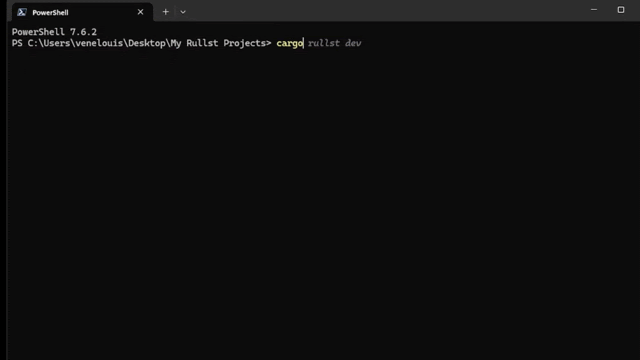
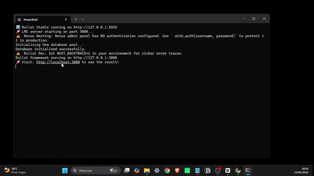

<p align="center">
  
</p>

<h1 align="center">Rullst 📜🦀🌐🚀</h1>
<h3 align="center"><i>Rust for those who want to build, not suffer.</i></h3>

<p align="center">
  <a href="https://crates.io/crates/rullst"></a>
  <a href="https://crates.io/crates/rullst"></a>
  <a href="https://docs.rs/rullst"></a>
  <a href="https://github.com/Rullst/Rullst/actions/workflows/ci.yml"></a>
  
</p>

<br/>

**Rullst** is an opinionated, developer-first full-stack web framework for Rust, obsessively designed for **Emotional Productivity**. It solves the biggest problem in the Rust web ecosystem: the high barrier of entry. With Rullst, you spend your energy building your business, not fighting borrow checkers and manual routing setups.

<h3 align="center">🛡️ Enterprise-Grade Security</h3>

<p align="center">
  Rullst is built with a "Zero-Panic Policy" and tested against the most rigorous standards in the industry.<br/>
  Our continuous pipeline guarantees absolute safety for production edge infrastructure:
</p>

<div align="center">

| Security Audit | Status | Description |
| :--- | :---: | :--- |
| **OSSF Scorecard** | [](https://github.com/Rullst/Rullst/actions/workflows/scorecards.yml) | Supply-chain security & best practices |
| **Codecov** | [](https://codecov.io/gh/Rullst/Rullst) | Strict code coverage enforcement |
| **OpenSSF** | [](https://www.bestpractices.dev/projects/13321) | Open source security standards |
| **Continuous Fuzzing** | [](https://github.com/Rullst/Rullst/actions/workflows/fuzzing.yml) | Fuzzing against edge cases & panics |
| **CodeQL SAST** | [](https://github.com/Rullst/Rullst/actions/workflows/codeql.yml) | Advanced semantic code analysis |
| **OWASP ZAP DAST** | [](https://github.com/Rullst/Rullst/actions/workflows/dast-zap.yml) | Dynamic vulnerability scanning |
| **Cargo Deny** | [](https://github.com/Rullst/Rullst/actions/workflows/cargo-deny.yml) | Banning unmaintained/vulnerable crates |

</div>

<!--
| **Mutation Testing** | [](https://github.com/Rullst/Rullst/actions/workflows/mutants.yml) | Validating test suite exhaustiveness |
-->

<br>
<h2 align="center"> CLI ⚡ Rullst Framework ⚡ </h2>
<p align="center">
  
</p>

<h2 align="center">Click to Watch: How to build a SaaS Blueprint with Rullst </h2>
<p align="center">
<a href="https://www.youtube.com/watch?v=nDXLeNM327g">
  
</a>
</p>

<p align="center">Rullst LMS Blueprint from CLI
  
</p>


---

### ⚡ Unmatched Performance

Rullst's "Zero-Cost Abstraction" architecture provides full-stack productivity without sacrificing bare-metal speed. In our official [Criterion micro-benchmarks](BENCHMARKS.md):

- **SSR Rendering**: `~1.07 µs` (4.2x faster than Dioxus, 8.5x faster than Leptos).
- **Routing**: `~974 ns` (Identical latency to raw Axum).

### ✨ The "Wow" Factor

Rullst brings the ergonomics of Laravel and Ruby on Rails to the blazing-fast, memory-safe world of Rust:

- **Rullst Nexus**: An auto-generated, dark-mode CMS & Admin Panel directly from your Structs.
- **Hot-Reloading**: Sub-second native DLL hot-swapping. Change your Rust code and see it instantly.
- **Zero-Panic Policy**: Hardened architecture built for production edge infrastructure.
- **Interactive Scaffolding**: 1-click generators for Auth, ERPs, Uptime Monitors, and Deployments.

---

### 💻 The Beauty of Rullst

```rust
use rullst::{routing::get, html, Server, Response};

#[routes]
fn home() -> Response {
    html! {
        <div class="h-screen bg-slate-900 text-emerald-400 flex items-center justify-center">
            <h1>"Hello, Rullst!"</h1>
        </div>
    }
}

#[tokio::main]
async fn main() {
    Server::new()
        .route("/", get(home))
        .run()
        .await;
}
```

---

### 📚 Documentation & Community

We've rewritten our entire documentation from scratch into a beautiful, high-performance website. Discover everything Rullst can do, read the benchmarks, and master the framework:

👉 **[Explore the Official Website & Docs](https://rullst.github.io/#docs)**

💬 **[Join the Community on Discord](https://discord.gg/2ntKFtsSjw)**

> **Found a bug?** [Report an Issue](https://github.com/Rullst/Rullst/issues)
