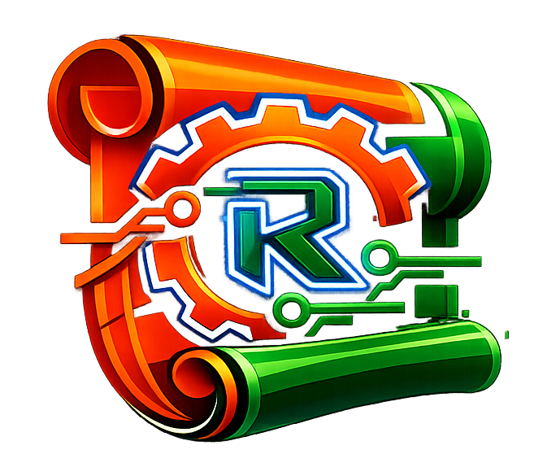

<p align="center">
  
</p>

# Rullst - 📜🦀🌐🤖🚀
### *"Rust for those who want to build, not suffer."*

*Read this in [Português (Brasil)](./README.pt.md).*


**Rullst** (Rust + Fullstack) is an opinionated, developer-first full-stack web framework for Rust, obsessively designed for **Emotional Productivity**. 

It was created to solve the biggest problem in the Rust web ecosystem: the high barrier of entry that turns web programming into a PhD research on compiler design. We believe you should spend your energy building your business, not fighting borrow checkers and manual routing setups.

---

## 💡 The Rullst Manifesto

> *"Most Rust frameworks treat the web developer like a compiler engineer. Rullst treats the developer like someone who wants to build awesome products at lightning speed."*

In the current ecosystem, to write a simple CRUD, you are forced to glue dozens of crates together, manually map nested routing trees, write verbose ORMs requiring multiple structs, and continuously clone variables inside dynamic HTML templates just to satisfy the borrow checker.

Rullst redefines this experience. We offer an integrated, cohesive developer experience that brings the sweetness and iteration speed of **Laravel and Next.js** together with the Formula 1 performance and military-grade safety of **Rust, Axum, and Hyper**:

* **No More Frankenstein setups:** A single cohesive framework managing your server (Axum), your database (`rust-eloquent`), and your HTML rendering.
* **No More Borrow Checker fights in UI:** Our compile-time JSX-like `html!` macro processes pure elements on the server (SSR). It generates optimized string-builders directly at compile time. It's blazing fast, safe, and SEO-friendly by default.
* **First-Class Active Record ORM:** Native integration with your **`rust-eloquent`** package. Interacting with databases is as intuitive as `user.save()`.
* **AI-Native Engineering & AI-Friendly:** Designed from the ground up for modern pair-programming. Strict type-safety, zero dynamic runtime magic, automatic `.ai-rules` scaffolding, and structured schemas prevent AI agent hallucinations and allow instant compiler self-correction.

---

## 🎨 The "Hello World" That Conquers at First Sight

This is a complete, fully operational web server with type-safe routing, compile-time HTML rendering, and automatic XSS escaping. It is exactly **20 lines of code**:

```rust
use rullst::{html, routes, Server, Router, response::{Html, IntoResponse}};

async fn hello() -> impl IntoResponse {
    Html(html! {
        <main style="display: grid; place-items: center; height: 100vh; background: #090d16; color: #fff; font-family: system-ui;">
            <div style="text-align: center;">
                <h1 style="font-size: 4rem; margin: 0; background: linear-gradient(135deg, #00f2fe, #4facfe); -webkit-background-clip: text; -webkit-text-fill-color: transparent;">
                    "Hello, World!"
                </h1>
                <p style="color: #64748b; font-size: 1.25rem; margin-top: 1rem;">
                    "Written in Rust. Rendered in microseconds. Safe by default."
                </p>
            </div>
        </main>
    })
}

#[tokio::main]
async fn main() -> Result<(), Box<dyn std::error::Error>> {
    Server::new(routes![get("/" => hello)])
        .run(3000)
        .await?;
    Ok(())
}
```

---

## ⚡ Get Started in 10 Seconds

Scaffold a fully operational application with our interactive CLI wizard!

```bash
# 1. Run the interactive CLI scaffolding tool
cargo rullst new

# The wizard will prompt you:
# 🚀 App name? -> my-app
# 🏗️ What would you like to build? -> SaaS App / REST API
# 🗄️ Select a DB Provider -> Sqlite / Postgres / MySQL

# 2. Enter the project folder
cd my-app

# 3. Start your high-performance full-stack app immediately!
cargo run
```

---

## 🛠️ The Full-Stack Active Record Experience

When your application grows, Rullst scales with you using Active Record:

```rust
use rullst::{html, routes, Server, Router, response::{Html, IntoResponse}};
use rust_eloquent::{Eloquent, EloquentModel, sqlx::{self, FromRow}};

#[derive(Debug, Clone, FromRow, rust_eloquent::Eloquent)]
#[eloquent(table = "users")]
pub struct User {
    pub id: i32,
    pub name: String,
}

async fn home() -> impl IntoResponse {
    // Elegant, type-safe data fetching
    let users = User::all().await.unwrap();

    Html(html! {
        <div style="background: #0f172a; color: #fff; padding: 5rem; text-align: center; font-family: sans-serif;">
            <h1>"Total Active Users: " {users.len()}</h1>
        </div>
    })
}

// 1. Declare the artisan macro here to intercept CLI arguments for migrations
rullst::artisan!();

#[tokio::main]
async fn main() -> Result<(), Box<dyn std::error::Error>> {
    // 2. The artisan! macro automatically intercepts `db:*` commands and exits early.
    // If it's a normal run, it continues server execution here.

    let router = routes![
        get("/" => home),
    ];

    Server::new(router)
        .run(3000)
        .await?;

    Ok(())
}
```

---

## 🗄️ Database Migrations (Artisan CLI)

Rullst includes an embedded, high-performance migration runner. You don't need external binaries. The framework ships with a CLI tool that parses pure Rust closures to construct your schema safely.

```bash
# Scaffold a new migration using pure Rust DSL
cargo rullst make:migration create_users_table

# Run all pending migrations against your database
cargo rullst db:migrate

# Rollback the last batch of migrations
cargo rullst db:rollback
```

Under the hood, these commands are intercepted by the `rullst::artisan!()` macro, guaranteeing the server never starts when you only want to migrate your database.

---

## 🛡️ Self-Healing Upgrades

Afraid of breaking changes when upgrading the framework? Don't be. Rullst was built with a "Self-Healing Upgrades" philosophy. 

When a new version of Rullst introduces API changes, we never break your code immediately. Instead, we use `#[deprecated]` warnings. You can update your entire application automatically using our CLI:

```bash
cargo rullst upgrade
```

This command will safely update the Rullst dependency and use Rust's powerful `cargo fix` refactoring tools to automatically rewrite your code to match the new API signatures. Stress-free upgrades, forever.

---

## 🎯 Architecture under the hood (v0.9.0)

Rullst is structured as a modular monorepo Cargo Workspace to optimize compile times:

1. **`rullst` (Core Crate):** Wraps and configures Axum, handles life-cycle DB injection, and exposes response types. Also ships with first-class production utilities (Queue, Cache, Scheduler) and enterprise features (Validation, Mailer, Storage, WebSockets, and Horizon).
2. **`rullst-macros` (Compiler-Engine):** Procedural JSX-like compiler that outputs safe memory-buffer string extensions in compile time.
3. **`cargo-rullst` (CLI Scaffold):** Scaffolds clean, isolated local-linked workspaces that compile out-of-the-box.

For detailed technical conventions, directory structures, and framework APIs, refer to our [Official Specification (SST)](./docs/spec.md).

---

## 📝 License

Distributed under the MIT License. See `LICENSE` for more details.
