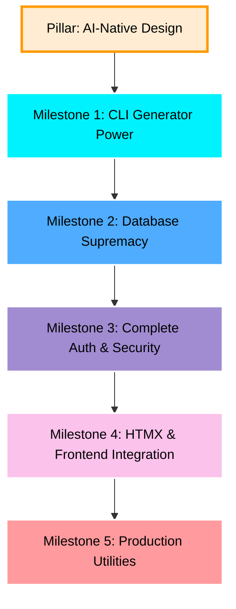

# Rullst Roadmap 🗺️
### *"The Path to the Ultimate Full-Stack Rust Framework"*

*Read this in [Português (Brasil)](./ROADMAP.pt.md).*

This roadmap outlines the milestones required to transition **Rullst** from its current MVP (v0.1.0) into a dominant, production-ready, full-stack framework focused on **Emotional Productivity** and **AI-Native Engineering**.

Our development strategy follows the **"Developer Experience like Laravel, Performance like Rust, Architected for Humans and AI"** philosophy.

---

## 🤖 The AI-Native Paradigm (Designed for Humans & AI)

Almost every modern web framework (Laravel, Ruby on Rails, Next.js) was built before the era of LLMs and AI Agents. They rely heavily on runtime magic, dynamic reflection, and complex implicitness that confuses AI coders and leads to hallucinations.

**Rullst is built from the ground up to be the first AI-Native web framework:**
1. **Zero Runtime Magic, Pure Compilation:** High-level declarative macros (`#[derive(Eloquent)]`, `routes!`) and strict Rust type safety give AI coding assistants extremely explicit structures, resulting in zero API hallucinations and instant compiler self-correction.
2. **Context-Rich Scaffolding:** `cargo rullst new` will automatically scaffold optimized `.ai-rules` / `.cursorrules` files. Any AI agent opening the project instantly learns Rullst's exact conventions, code style, and API standards, achieving 100% productive pair-programming immediately.
3. **Structured System Discovery:** In dev mode, Rullst will generate a local structural schema (`rullst-schema.json`) detailing all active routes, controllers, and models. This lets AI agents map out the entire project structure in milliseconds.

---

## 🚀 The Rullst Master Plan

---

## 🛠️ Milestone 1: CLI Empowerment (`cargo-rullst`)
**Goal:** Enable lightning-fast scaffolding. Developers should never create boilerplate files manually.

- [x] **Code Generators:**
  - [x] `cargo rullst make:controller <Name>` - Generates a controller with standard CRUD actions.
  - [x] `cargo rullst make:model <Name> [-m]` - Generates an Active Record model and optionally an associated migration.
  - [x] `cargo rullst make:middleware <Name>` - Generates Axum-compatible custom middleware.
- [x] **Workspace Ergonomics:**
  - [x] Improve compilation speeds for CLI runs.
  - [x] Support `--api` flag for scaffolding headless REST APIs instead of full HTML apps.

---

## 🗄️ Milestone 2: Database Supremacy (Migrations & Relationships)
**Goal:** Empower `rust-eloquent` and `Rullst` to handle enterprise-grade relational schemas seamlessly.

> [!NOTE]
> **Division of Responsibilities:**
> The heavy lifting (database schema parsers, migration execution, and relationship macro builders) will be developed directly inside the **`rust-eloquent`** repository to keep the ORM modular.
> **Rullst** will wrap these features with CLI commands and smooth dependency injection.

- [x] **Migration Engine (in `rust-eloquent`):**
  - [x] SQL-based or DSL-based migration definitions.
  - [x] CLI runner inside Rullst:
    - [x] `cargo rullst db:migrate` - Runs pending migrations.
    - [x] `cargo rullst db:rollback` - Reverts the last migration batch.
    - [x] `cargo rullst db:status` - Shows the migration history.
- [x] **Active Record Relationships (in `rust-eloquent`):**
  - [x] `HasMany` / `BelongsTo` declarative macros.
  - [x] `BelongsToMany` (Many-to-Many) association resolvers.
  - [x] Lazy and Eager loading mechanisms to prevent N+1 query problems.
- [x] **Seeders and Factories:**
  - [x] `cargo rullst db:seed` - Populate databases using pre-configured mock data.
  - [x] Integrated factory pattern for mock entity generation.

---

## 🔒 Milestone 3: Authentication & Security (Social & Local Auth)
**Goal:** Implement robust, secure, and instant authentication. Developers should be able to authenticate users securely in minutes.

- [x] **Social Authentication via `rust-socialite`:**
  - [x] Leverage the custom **[`rust-socialite`](https://crates.io/crates/rust-socialite)** crate as the official OAuth engine.
  - [x] Out-of-the-box configurations for Google, GitHub, Facebook, Twitter, and custom providers.
  - [x] Seamless flow: redirect to provider, parse callbacks, and login/register users via Active Record.
- [x] **Local Authentication:**
  - [x] Secure password hashing via Argon2/Bcrypt built-in helpers.
  - [x] Custom session-based cookie middleware and token-based (JWT) auth middleware.
- [x] **The "Auth Magic" Command:**
  - [x] `cargo rullst auth` - Instantly scaffold a full-fledged authentication system containing:
    - Login/Registration/Password Reset controllers.
    - Beautiful UI screens (`html!` templates) pre-configured with CSS.
    - SQL database migration for the `users` table.
- [x] **Security Defaults:**
  - [x] Automatic CSRF protection for HTML form submissions.
  - [x] Default security headers middleware (CORS, HSTS, X-Content-Type-Options).

---

## ⚡ Milestone 4: HTMX & Interactivity
**Goal:** Combine the simplicity of Server-Side Rendering (SSR) with the snappy feeling of modern Single-Page Applications (SPAs).

- [x] **HTMX First-Class Support:**
  - [x] Built-in response helpers for checking HTMX headers (`rullst::htmx::is_htmx(req)`).
  - [x] Native support for partial template rendering (rendering only the requested component, not the full page layout).
  - [x] TailwindCSS auto-integration during project setup.

---

## 📦 Milestone 5: Production Utilities (Queues, Cache, Scheduler)
**Goal:** Provide the tools needed to scale applications in production environment.

- [x] **Docker & Containerization:**
  - [x] `cargo rullst new <name> --docker` flag to generate a production-ready `Dockerfile`.
  - [x] Auto-generated `docker-compose.yml` for local development (App + DB + Redis).
  - [x] Optimized multi-stage builds (`scratch` / `distroless`) for ultra-small, fast, and secure Rust deployments.
- [x] **Queues & Background Workers:**
  - [x] `rullst::queue` API supporting SQLite (for local dev) and Redis (for production).
  - [x] Asynchronous task workers executing jobs in the background.
- [x] **Caching Layer:**
  - [x] `rullst::cache` unified driver API supporting In-Memory and Redis adapters.
- [x] **Task Scheduler:**
  - [x] Declarative Cron-like job scheduler directly in `main.rs` (e.g. `.schedule("0 0 * * *", nightly_cleanup)`).

---

## 🏢 Milestone 6: Enterprise Features
**Goal:** Deliver the classic robust features expected from enterprise-grade frameworks.

- [x] **Declarative Validation:** A `#[derive(Validate)]` macro for DTOs/structs that automatically returns 422 JSON for APIs or HTML error partials for HTMX when validation fails.
- [x] **Mailer System (`rullst::mail`):** Fluent API for sending emails with drivers for SMTP, Resend, and SendGrid, supporting native `html!` templates.
- [x] **Storage Abstraction (`rullst::storage`):** Unified API for file uploads and management with drivers for Local (Disk), AWS S3, and Cloudflare R2.
- [x] **WebSockets & Real-Time:** Built-in router support for WebSockets, perfectly integrated with HTMX (`hx-ext="ws"`).
- [x] **Rullst Horizon:** A beautiful built-in web dashboard to monitor queues, see failed jobs, and retry them visually.

---

## 🚀 Milestone 7: The "Unfair Advantage" (Industry Dominance)
**Goal:** Push Rullst beyond what is possible in other languages, making it the undeniable king of modern web development.

- [ ] **Rullst Live (Server-Driven UI):** Similar to Phoenix LiveView or Laravel Livewire. Write stateful Rust components that automatically sync with the browser over WebSockets, giving SPA interactivity without writing a single line of JavaScript.
- [ ] **AI-Native Core (`rullst::ai`):** Built-in declarative abstractions for LLMs (OpenAI, Gemini), Vector Databases, and Agents. Build RAG apps and AI agents in minutes.
- [ ] **Rullst Studio:** A built-in visual GUI to inspect, filter, and edit your database records locally (similar to Prisma Studio). Triggered via `cargo rullst studio`.
- [ ] **Declarative E2E Testing:** A fluent, Laravel-style testing API: `app.get("/login").assert_status(200).assert_see("Welcome");`.
- [ ] **Built-in Feature Flags:** Native support for toggling features and running A/B tests with zero external dependencies.
- [ ] **Wasm Islands (`#[client_component]`):** Write frontend interactive components directly in Rust. Rullst will automatically compile these specific components to lightweight WebAssembly and hydrate them on the client side, eliminating the need to write any JavaScript!
- [ ] **AI-Powered "Self-Healing" Error Console:** An interactive development error page (similar to Laravel Ignition) with integrated local AI assistants. When a runtime or compilation error occurs, you will have an "Auto-Fix with Rullst AI" button that patches the correct code directly on your file system.
- [ ] **Native SaaS Multi-Tenancy (`rullst::multitenant`):** Out-of-the-box tenant isolation (multi-tenancy by subdomain, header, or DB schema) configured declaratively with a single decorator/macro.
- [ ] **Hot Reloading via Dynamic Linking:** Drastically reduce development compile times using dynamic library loading (`dylib` / `.so`), allowing route and template changes with instant sub-second feedback loop.

---

## 🗺️ Execution Strategy

We will proceed **milestone by milestone**, starting with **Milestone 1** to polish our CLI generators. 

If you are ready to begin, select a task or suggest which component to build next! 🚀
