# Rullst Roadmap 🗺️
### *"The Path to the Ultimate Full-Stack Rust Framework"*

This roadmap outlines the milestones required to transition **Rullst** from its current MVP (v0.1.0) into a dominant, production-ready, full-stack framework focused on **Emotional Productivity** and **AI-Native Engineering**.

Our development strategy follows the **"Developer Experience like Laravel, Performance like Rust, Architected for Humans and AI"** philosophy.

---

## 🤖 The AI-Native Paradigm (Designed for Humans & AI)

Almost every modern web framework (Laravel, Ruby on Rails, Next.js) was built before the era of LLMs and AI Agents. They rely heavily on runtime magic, dynamic reflection, and complex implicitness that confuses AI coders and leads to hallucinations.

**Rullst is built from the ground up to be the first AI-Native web framework:**
1. **Zero Runtime Magic, Pure Compilation:** High-level declarative macros (`#[derive(Orm)]`, `routes!`) and strict Rust type safety give AI coding assistants extremely explicit structures, resulting in zero API hallucinations and instant compiler self-correction.
2. **Context-Rich Scaffolding:** `cargo rullst new` will automatically scaffold optimized `.ai-rules` / `.cursorrules` files. Any AI agent opening the project instantly learns Rullst's exact conventions, code style, and API standards, achieving 100% productive pair-programming immediately.
3. **Structured System Discovery:** In dev mode, Rullst will generate a local structural schema (`rullst-schema.json`) detailing all active routes, controllers, and models. This lets AI agents map out the entire project structure in milliseconds.

---

## 🚀 The Rullst Master Plan

```mermaid
graph TD
    M0["🤖 Pillar: AI-Native Design"] --> M1["🛠️ M1: CLI Generator Power"]
    M1 --> M2["🗄️ M2: Database Supremacy"]
    M2 --> M3["🔒 M3: Auth & Security"]
    M3 --> M4["⚡ M4: HTMX & Frontend"]
    M4 --> M5["📦 M5: Production Utilities"]
    M5 --> M6["🏢 M6: Enterprise Features"]
    M6 --> M7["🚀 M7: The Unfair Advantage"]
    M7 --> M8["🌍 M8: Edge Fusion & Auto-Upgrade"]
    M8 --> M9["🆓 M9: The Free Enterprise Revolution"]
    M9 --> M10["🛠️ M10: Incremental Compilation"]
    M10 --> M11["📊 M11: Telemetry & Radar"]
    M11 --> M12["💎 M12: Zero-Copy Streaming"]
    M12 --> M13["🔮 M13: Omni-Frontend & AI"]
    M13 --> M14["🤖 M14: Agentic DevOps"]
    M14 --> M15["🌐 M15: Intent-Based DB"]
    M15 --> M16["🧬 M16: Self-Evolving Core"]
    M16 --> M17["🔬 M17: Quantum-Ready"]

    style M0  fill:#ffecd2,stroke:#ff9a00,stroke-width:3px,color:#000
    style M1  fill:#00f2fe,stroke:#fff,stroke-width:2px,color:#000
    style M2  fill:#4facfe,stroke:#fff,stroke-width:2px,color:#000
    style M3  fill:#a18cd1,stroke:#fff,stroke-width:2px,color:#000
    style M4  fill:#fbc2eb,stroke:#fff,stroke-width:2px,color:#000
    style M5  fill:#ff9a9e,stroke:#fff,stroke-width:2px,color:#000
    style M6  fill:#b5ffd9,stroke:#fff,stroke-width:2px,color:#000
    style M7  fill:#ffe57f,stroke:#fff,stroke-width:2px,color:#000
    style M8  fill:#e1bee7,stroke:#fff,stroke-width:2px,color:#000
    style M9  fill:#b3e5fc,stroke:#fff,stroke-width:2px,color:#000
    style M10 fill:#ffccbc,stroke:#fff,stroke-width:2px,color:#000
    style M11 fill:#c8e6c9,stroke:#fff,stroke-width:2px,color:#000
    style M12 fill:#f8bbd0,stroke:#fff,stroke-width:2px,color:#000
    style M13 fill:#dcedc8,stroke:#fff,stroke-width:2px,color:#000
    style M14 fill:#fff9c4,stroke:#fff,stroke-width:2px,color:#000
    style M15 fill:#b2ebf2,stroke:#fff,stroke-width:2px,color:#000
    style M16 fill:#a5d6a7,stroke:#fff,stroke-width:3px,color:#000
    style M17 fill:#e0f7fa,stroke:#fff,stroke-width:3px,color:#000
```



---

## 🛠️ Milestone 1: CLI Empowerment (`cargo-rullst`)
**Goal:** Enable lightning-fast scaffolding. Developers should never create boilerplate files manually.

- [x] **Code Generators:**
  - [x] `cargo rullst make:controller <Name>` - Generates a controller with standard CRUD actions.
  - [x] `cargo rullst make:model <Name> [-m]` - Generates an Active Record model and optionally an associated migration.
  - [x] `cargo rullst make:middleware <Name>` - Generates Axum-compatible custom middleware.
  - [x] `cargo rullst make:cors` & `make:jwt` - Scaffold essential boilerplate middlewares directly into your project.
  - [x] `cargo rullst generate:openapi` - AI-Driven OpenAPI/Swagger generator without heavy macros.
  - [x] `cargo rullst make:worker` - Scaffold background task workers.
- [x] **Workspace Ergonomics:**
  - [x] Improve compilation speeds for CLI runs.
  - [x] Support `--api` flag for scaffolding headless REST APIs instead of full HTML apps.

---

## 🗄️ Milestone 2: Database Supremacy (Migrations & Relationships)
**Goal:** Empower `rullst-orm` and `Rullst` to handle enterprise-grade relational schemas seamlessly.

> [!NOTE]
> **Division of Responsibilities:**
> The heavy lifting (database schema parsers, migration execution, and relationship macro builders) will be developed directly inside the **`rullst-orm`** repository to keep the ORM modular.
> **Rullst** will wrap these features with CLI commands and smooth dependency injection.

- [x] **Migration Engine (in `rullst-orm`):**
  - [x] SQL-based or DSL-based migration definitions.
  - [x] CLI runner inside Rullst:
    - [x] `cargo rullst db:migrate` - Runs pending migrations.
    - [x] `cargo rullst db:rollback` - Reverts the last migration batch.
    - [x] `cargo rullst db:status` - Shows the migration history.
- [x] **Active Record Relationships (in `rullst-orm`):**
  - [x] `HasMany` / `BelongsTo` declarative macros.
  - [x] `BelongsToMany` (Many-to-Many) association resolvers.
  - [x] Lazy and Eager loading mechanisms to prevent N+1 query problems.
- [x] **Seeders and Factories:**
  - [x] `cargo rullst db:seed` - Populate databases using pre-configured mock data.
  - [x] Integrated factory pattern for mock entity generation.

---

## 🔒 Milestone 3: Authentication & Security (Social, Local & Passkeys)
**Goal:** Implement robust, secure, and instant authentication. Developers should be able to authenticate users securely in minutes.

- [x] **Social Authentication via `rullst-connect`:**
  - [x] Leverage the custom **[`rullst-connect`](https://crates.io/crates/rullst-connect)** crate as the official OAuth engine.
  - [x] Out-of-the-box configurations for Google, GitHub, Facebook, Twitter, and custom providers.
  - [x] Seamless flow: redirect to provider, parse callbacks, and login/register users via Active Record.
- [x] **Local Authentication:**
  - [x] Secure password hashing via Argon2/Bcrypt built-in helpers.
  - [x] Custom session-based cookie middleware and token-based (JWT) auth middleware.
- [x] **Passkeys & Biometrics First (`rullst::auth::passkey`):** Native WebAuthn abstraction for biometric authentication (FaceID, TouchID, Windows Hello) bundled into `cargo rullst auth`. Passwordless signups and logins using public-key cryptography via HTMX/WebAuthn with smooth security key fallbacks.
- [x] **The "Auth Magic" Command:**
  - [x] `cargo rullst auth` - Instantly scaffold a full-fledged authentication system containing:
    - Login/Registration/Password Reset controllers.
    - Beautiful UI screens (`html!` templates) pre-configured with CSS.
    - SQL database migration for the `users` table.
- [x] **Security Defaults:**
  - [x] Automatic CSRF protection for HTML form submissions.
  - [x] Default security headers middleware (CORS, HSTS, X-Content-Type-Options).

---

## ⚡ Milestone 4: HTMX & Interactivity
**Goal:** Combine the simplicity of Server-Side Rendering (SSR) with the snappy feeling of modern Single-Page Applications (SPAs).

- [x] **HTMX First-Class Support:**
  - [x] Built-in response helpers for checking HTMX headers (`rullst::htmx::is_htmx(req)`).
  - [x] Native support for partial template rendering (rendering only the requested component, not the full page layout).
  - [x] TailwindCSS auto-integration during project setup.

---

## 📦 Milestone 5: Production Utilities (Queues, Cache, Scheduler & Assets)
**Goal:** Provide the tools needed to scale applications in production environment.

- [x] **Docker & Containerization:**
  - [x] `cargo rullst new <name> --docker` flag to generate a production-ready `Dockerfile`.
  - [x] Auto-generated `docker-compose.yml` for local development (App + DB + Redis).
  - [x] Optimized multi-stage builds (`scratch` / `distroless`) for ultra-small, fast, and secure Rust deployments.
- [x] **Queues & Background Workers:**
  - [x] `rullst::queue` API supporting SQLite (for local dev) and Redis (for production).
  - [x] Asynchronous task workers executing jobs in the background.
- [x] **Caching Layer:**
  - [x] `rullst::cache` unified driver API supporting In-Memory and Redis adapters.
- [x] **Task Scheduler:**
  - [x] Declarative Cron-like job scheduler directly in `main.rs` (e.g. `.schedule("0 0 * * *", nightly_cleanup)`).
- [x] **Edge-Optimized Assets & Compression Tuning:** Automatically generate pre-compiled assets compressed via **Brotli (level 11)** and **Zstandard** during `cargo rullst build --release`. Zero-copy static file serving via Axum using `sendfile` system calls directly at the kernel level, outperforming standalone Nginx serving speeds.

---

## 🏢 Milestone 6: Enterprise Features (Validation, Mail, Storage & Protection)
**Goal:** Deliver the classic robust features expected from enterprise-grade frameworks.

- [x] **Declarative Validation:** A `#[derive(Validate)]` macro for DTOs/structs that automatically returns 422 JSON for APIs or HTML error partials for HTMX when validation fails.
- [x] **Mailer System (`rullst::mail`):** Fluent API for sending emails with drivers for SMTP, Resend, and SendGrid, supporting native `html!` templates.
- [x] **Storage Abstraction (`rullst::storage`):** Unified API for file uploads and management with drivers for Local (Disk), AWS S3, and Cloudflare R2.
- [x] **WebSockets & Real-Time:** Built-in router support for WebSockets, perfectly integrated with HTMX (`hx-ext="ws"`).
- [x] **Rullst Zenith:** A beautiful built-in web dashboard to monitor queues, see failed jobs, and retry them visually.
- [x] **Adaptive Backpressure & Resilient Traffic Shielding:** Router-level protection middleware that tracks async Tokio thread pools and database response timings. Smoothly degrades traffic or queues excessive loads when database exhaustion or CPU saturation is imminent, preventing out-of-memory (OOM) crashes.
- [x] **Token-Bucket Rate Limiting:** Native rate limiting attributes (e.g., `#[route(get, "/api", rate_limit = "100/m")]`) with Shared-Memory (`DashMap`) or Redis engines.

---

## 🚀 Milestone 7: The "Unfair Advantage" (Industry Dominance)
**Goal:** Push Rullst beyond what is possible in other languages, making it the undeniable king of modern web development.

- [x] **Rullst Live (Server-Driven UI):** Write stateful Rust components that automatically sync with the browser via WebSockets. SPA interactivity without writing a single line of JavaScript.
- [x] **AI-Native Core (`rullst::ai`):** Built-in declarative abstractions for LLMs (OpenAI, Gemini, Anthropic, Ollama), Vector Databases, and Agents. Build RAG apps and AI agents in minutes.
- [x] **Rullst Studio:** A built-in visual GUI to inspect, filter, and edit your database records locally. Triggered via `cargo rullst studio`.
- [x] **Declarative E2E Testing:** A fluent testing API: `app.get("/login").assert_status(200).assert_see("Welcome");`.
- [x] **Built-in Feature Flags:** Native support for toggling features and running A/B tests with zero external dependencies.
- [x] **Wasm Islands (`#[client_component]`):** Write frontend interactive components directly in Rust. Rullst will automatically compile these specific components to lightweight WebAssembly and hydrate them on the client side, eliminating the need to write any JavaScript!
- [x] **AI-Powered "Self-Healing" Error Console:** An interactive development error page with integrated local AI assistants. When a runtime or compilation error occurs, you will have an "Auto-Fix with Rullst AI" button that patches the correct code directly on your file system.
- [x] **Native SaaS Multi-Tenancy (`rullst::multitenant`):** Out-of-the-box tenant isolation (multi-tenancy by subdomain, header, or DB schema) configured declaratively with a single decorator/macro.
- [x] **Hot Reloading via Dynamic Linking:** Drastically reduce development compile times using dynamic library loading (`dylib` / `.so`), allowing route and template changes with instant sub-second feedback loop.

---

## 🌍 Milestone 8: Distributed Data & Edge Fusion
**Goal:** Run Rullst on modern Edge infrastructure with zero rewrites and ultra-low latency globally.

- [x] **Rullst Edge Runtime (`rullst::edge`):** Native support for compiling and running Rullst apps in WebAssembly infrastructure (Cloudflare Workers, Fastly Compute, AWS Lambda@Edge) abstracting Tokio/WASI differences.
- [x] **Zero-Config SQLite Replication:** Native drivers for edge-distributed databases (Turso/libsql, Cloudflare D1) integrated into `rullst-orm`. Read/write locally at 1ms latency while the framework syncs globally in the background.

### 🔄 Autonomous Upgrade System (`cargo rullst upgrade`)

> One of the biggest DX challenges in any full-stack framework is keeping dependencies updated without breaking user code. Rust makes this even more critical — minor/patch version bumps in low-level crates can cause hard compile-time errors. This system makes Rullst upgrades nearly invisible.

- [x] **Non-Intrusive Background Version Check:** Every time the user runs frequent commands like `cargo rullst new` or `cargo rullst dev`, the CLI performs a lightweight async HTTP request (in a background thread, never blocking the terminal) to the Crates.io public API (`https://crates.io/api/v1/crates/rullst`) and compares the latest remote version with the version pinned in the user's `Cargo.toml`. The result is cached in a local temp file and refreshed at most once per day, so there is zero network overhead on repeated commands.

- [x] **Elegant Terminal Notification Box:** If a new version is detected, the CLI renders a non-blocking info box directly in the terminal output — styled with `colored` — immediately after the command completes:
  ```
  ┌────────────────────────────────────────────────────────────┐
  │  🚀 New Rullst version available: 1.0.5 → 1.1.0            │
  │  Run 'cargo rullst upgrade' to update safely with           │
  │  automatic code fixes (codemods).                           │
  └────────────────────────────────────────────────────────────┘
  ```

- [x] **Automated Codemods (Zero-Breaking Upgrades):** Expand `cargo rullst upgrade` into a full autonomous refactoring pipeline:
  1. **Manifest update:** The CLI rewrites the `rullst`, `rullst-macros`, and `rullst-orm` version strings in the user's `Cargo.toml` to the latest release.
  2. **Codemod execution:** A versioned registry of regex-based (or lightweight AST) search-and-replace rules is shipped with each CLI release. If a public API changed between versions (e.g., `.render()` renamed to `.render_page()`), the CLI automatically rewrites all matching occurrences inside `src/**/*.rs` before the user even sees a compile error.
  3. **Validation gate (`cargo check`):** After applying codemods, the CLI runs `cargo check` in background. If the compiler exits cleanly, the user sees: `"✅ Rullst updated successfully. No breaking changes detected."` If errors remain, a diff of the codemod changes is shown so the developer can review.

- [x] **Dependency Shielding (Internal Abstraction Casca):** Enforce the architectural rule that all heavy transitive dependencies (e.g. `sqlx`, `axum`, `tokio`, `lettre`) are always re-exported or wrapped inside Rullst's own public API surface. User code must never `use sqlx::*` directly — only `use rullst::db::*`. This shields user apps from upstream breakage: when `sqlx` releases a breaking version, only Rullst's internal adapter changes, and the user's code compiles untouched.


---

## 🆓 Milestone 9: The "Free Enterprise" Revolution
**Goal:** Disrupt the web framework ecosystem by providing premium SaaS and Enterprise tools 100% free and open-source, democratizing the tools to build million-dollar companies.

- [x] **Rullst Nexus Panel (Auto-Generated CMS):** A beautiful, out-of-the-box admin panel that reads your `rullst-orm` models and auto-generates a complete CMS. Implemented via `rullst::nexus` with `NexusModel` reflection trait, dynamic HTMX CRUD, live search, and an AI chat interface at `/nexus/chat` for natural language database queries.
- [x] **Dual-Engine Frontend Architecture:** Two new CLI generators empower developers to choose the right rendering engine:
  - **Rullst Hyper (Desktop):** `cargo rullst make:desktop` scaffolds a full Tauri (`src-tauri/`) wrapper. A background process orchestrator starts the Rullst Axum server, polls port 3000, and gracefully terminates it on window close. Includes smart binary icon generation (PNG/ICO/ICNS) to prevent compiler errors.
  - **Rullst Omni (Multi-Platform):** `cargo rullst make:omni` scaffolds a Dioxus v0.7 `omni-app/` project pre-wired to the Rullst backend API via reactive signals (`use_signal`, `use_future`), featuring a premium glassmorphic dark-mode UI with micro-animations.
- [x] **Rullst Capital (SaaS Billing Boilerplate):** `cargo rullst make:billing` generates complete Stripe/LemonSqueezy integration — database migrations for subscriptions, webhook processors for subscription lifecycle events, and styled checkout views.
- [x] **Rullst Shield (Wasm WAF & Bot Management):** Enterprise-grade security middleware compiled to WebAssembly for edge deployments. Includes behavioral rate limiting, AI scraper blocking, and automatic PII masking in response payloads.
- [x] **Rullst Foundry CLI (DevOps Tooling):** Built-in CLI commands to provision and deploy infrastructure automatically via a declarative `Foundry.toml` file, forming the open-source foundation for a future hosted 1-click cloud service. Supported providers:
  - **AWS** (EC2 + RDS + S3 + CloudFront)
  - **Hetzner Cloud** (VPS + Volumes + Floating IPs)
  - **Google Cloud Platform** (Compute Engine + Cloud SQL + Cloud Storage)
  - **Microsoft Azure** (Virtual Machines + Azure SQL + Blob Storage)
  - **Oracle Cloud Infrastructure** (OCI Compute + Autonomous DB + Object Storage)
  - **DigitalOcean** (Droplets + Managed Databases + Spaces)
  
  Each provider target provisions the server via SSH, installs Docker, deploys the Rullst binary inside a container, and automatically configures an HTTPS reverse proxy via Caddy with automatic SSL certificate management.

---

## 🛠️ Milestone 10: Instant Incremental Compilation & Linker Hacking
**Goal:** Eradicate compile-time friction in Rust and achieve interpreted-language feedback loop speeds.

- [x] **Rullst Mold/Cranelift Deep Integration:** Configure the framework's scaffolding to force ultra-fast linkers (like `mold`) and use the `Cranelift` compilation backend during development.
- [x] **Sub-100ms Feedback Loop:** Ensure that any business logic change isolates into a micro-module in memory, bringing the instant feedback of PHP/JS into strictly-typed Rust.

---

## 📊 Milestone 11: Hardware Telemetry & Radar
**Goal:** Make asynchronous debugging and performance profiling effortless without relying on complex external setups.

- [ ] **Rullst Radar (Kernel-Level Telemetry):** Real-time visual dashboard for hardware/software metrics. Detect CPU bottlenecks, Mutex contention, memory leaks, and I/O query bottlenecks with zero overhead.
- [ ] **Time-Travel Debugging in Error Console:** Add a state history of the last 50 events, HTMX clicks, and SQL queries to the "Self-Healing" console. Replay the exact scenario that caused a server panic.
- [ ] **Native OpenTelemetry:** Zero-config abstraction to export traces and logs to Datadog, Grafana Loki, or Prometheus.

---

## 💎 Milestone 12: Zero-Copy Event Streaming & Time-Travel Architecture
**Goal:** Natively unify the data lifecycle and eliminate the need for heavy external message brokers.

- [ ] **Rullst Ledger (`rullst::ledger`):** An Event Sourcing engine integrated directly into `rullst-orm`. Instead of just updating the state, the framework saves the immutable history of events by default using Zero-Copy persistence (memory-mapped files).
- [ ] **Built-in Event Streaming:** The Rullst binary itself acts as a distributed async message micro-broker across instances via WebSockets/QUIC, replacing the need for Kafka or RabbitMQ for internal data communication.

---

## 🔮 Milestone 13: Omni-Frontend Protocol & AI Expansion
**Goal:** Solidify Rullst as the ultimate backend for AI agents, SPAs, and Native Mobile apps.

- [ ] **Automatic TypeScript SDK Generation:** For routes exposed as REST/JSON or WebSockets, auto-generate a 100% typed TS client, eliminating tRPC or manual OpenAPI.
- [ ] **Hyper-Media Mobile Bridge:** A protocol allowing hybrid iOS/Android apps to consume partial HTMX/JSON responses and render native screens instantly (Server-Driven UI for mobile).
- [ ] **AI Agent Tool-Calling:** Automatically expose Rullst routes/controllers as executable "Tools" for external LLMs with auto-generated schemas (`rullst-schema.json`).
- [ ] **Dynamic Context Injection:** A secure `/_rullst/ai-context` endpoint providing real-time API documentation for client-integration AI agents.
- [ ] **AI-Powered DB Seeding:** `cargo rullst db:seed --ai` leverages local LLMs to generate ultra-realistic, context-aware mock data.

---

## 🤖 Milestone 14: Agentic DevOps & Autonomous Infrastructure
**Goal:** Leverage the Rullst compiler's deep understanding of the project schema to manage not just code, but production infrastructure and CI/CD.

- [ ] **Autonomous Provisioning (`cargo rullst deploy --autonomous`):** The compiler analyzes your code (e.g., if you use `rullst::storage::S3`, it provisions a bucket) and talks to cloud providers directly, eliminating complex Terraform files.
- [ ] **AI-Driven CI/CD Bottleneck Analysis:** Automated testing pipelines that use local LLMs to evaluate performance regressions. If a commit slows a route, the AI profiles the Tokio stack and suggests the exact line causing the bottleneck.

---

## 🌐 Milestone 15: AI-Generated Autonomous Migrations & Intent-Based DB
**Goal:** Invert the database design flow by having AI generate optimized schemas and indices based on plain text intentions.

- [ ] **Intent-Based Modeling:** Describe your entity using rich Rust comments. The Rullst AI CLI understands the business intent, calculates the best indexing strategy, and generates a perfectly optimized migration automatically.
- [ ] **Self-Optimizing Indexes:** In production, Rullst monitors slow queries in real-time (using Radar Telemetry) and autonomously suggests or safely applies secondary indices to eliminate slow table scans.

---

## 🧬 Milestone 16: The Self-Evolving & Polymorphic Core
**Goal:** Transform the framework from a static tool into a living software organism that adapts, optimizes, and heals itself in production.

- [ ] **Polymorphic Code Generation:** Deep telemetry and local AI analyze production traffic. If a route receives millions of requests with a specific data pattern, the framework rewrites and recompiles its own internal logic in the background (via Dynamic Linking) to create an ultra-optimized execution path.
- [ ] **Autonomous Error Auto-Healing in Production:** If the system detects a novel panic in production, the AI analyzes the log, writes a corrective patch, runs the test suite in the background, and hot-swaps the router in under 1 second—all without human intervention. The developer just wakes up to a report saying the bug was fixed.

---

## 🔬 Milestone 17: Quantum-Ready Web Architecture (The Post-Quantum Era)
**Goal:** Future-proof the framework's security and compute layers against the rise of commercial quantum computing.

- [ ] **Native Post-Quantum Cryptography (PQC):** Gradually replace standard encryption algorithms (JWT, Cookies, Sessions) with quantum-resistant algorithms (like Kyber and Dilithium) based on NIST standards.
- [ ] **Hybrid Security Abstraction:** Implement a hybrid transport layer (Classical TLS + Quantum TLS) by default, ensuring the app is shielded against "Harvest Now, Decrypt Later" attacks.
- [ ] **Rullst QLink (`rullst::quantum`):** A driver abstraction layer to communicate with cloud Quantum Processing Units (QPUs like IBM Quantum, AWS Braket). Easily dispatch complex logistics or molecular simulation tasks to quantum computers natively in Rust.

---

## 🗺️ Execution Strategy

We will proceed **milestone by milestone**, starting with **Milestone 1** to polish our CLI generators. 

If you are ready to begin, select a task or suggest which component to build next! 🚀
