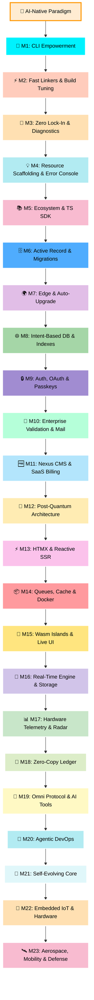

# Rullst Master Roadmap 🗺️
### *"The Path to the Ultimate Full-Stack Rust Framework"*

This roadmap outlines the strategic direction and technical milestones of **Rullst**, transitioning it from an ambitious full-stack architecture into the world's most productive, secure, and performant web framework.

Our philosophy: **"Security, Developer Experience and Performance, Architected for Humans and AI."**

---

## 📊 Executive Milestone Status Tracker

| Milestone | Category | Focus Area | Status |
| :--- | :--- | :--- | :---: |
| **M1** | 🎨 DX & Scaffolding | CLI Empowerment & Code Generators (`cargo-rullst make:*`) | `[x] Completed` |
| **M2** | 🎨 DX & Performance | Fast Linkers, Build Tuning & Sub-100ms Recompilation | `[x] Completed` |
| **M3** | 🎨 DX & Interop | Zero Lock-in, Granular Cargo Features & Proc-Macro Diagnostics | `[x] Completed` |
| **M4** | 🎨 DX & Productivity | Full Resource Scaffolding (`make:resource`) & Ignition Error Console | `[x] Completed` |
| **M5** | 🎨 DX & Ecosystem | Documentation Hub (VitePress) & AST TypeScript SDK Generator | `[x] Completed` |
| **M6** | 🗄️ Database & ORM | Active Record, Migrations, Seeders & Turso/libSQL (`rullst-orm`) | `[x] Completed` |
| **M7** | 🗄️ Database & Edge | Distributed Data, Wasm Edge Runtime & Autonomous Upgrade System | `[x] Completed` |
| **M8** | 🗄️ Database & AI | Intent-Based Modeling & Production Self-Optimizing Indexes | `[ ] Planned` |
| **M9** | 🔒 Security & Auth | Authentication Engine (Local, OAuth, Passkeys & WebAuthn) | `[x] Completed` |
| **M10** | 🔒 Security & Protection | Enterprise Utilities (Mailer, DTO Validation, Rate Limiting & Shield) | `[x] Completed` |
| **M11** | 🔒 Security & SaaS | Free Enterprise Revolution (Rullst Nexus CMS, Omni & SaaS Billing) | `[x] Completed` |
| **M12** | 🔒 Security & Quantum | Post-Quantum Web Architecture (NIST PQC & QLink Drivers) | `[ ] Planned` |
| **M13** | ⚡ Frontend & Interactivity | HTMX First-Class, Reactive SSR & Partial View Rendering | `[x] Completed` |
| **M14** | ⚡ Production Utilities | Queues, Redis/Memory Cache, Task Scheduler & Docker | `[x] Completed` |
| **M15** | ⚡ Frontend & Islands | Wasm Islands (`#[client_component]`), Live Server-Driven UI & Hot-Reloading | `[x] Completed` |
| **M16** | ⚡ Real-Time & Storage | Real-Time Engine (`rullst::realtime`), Storage & Package Registry (`cargo rullst pkg`) | `[ ] Planned (New)` |
| **M17** | 🤖 AI & Telemetry | Hardware Telemetry, Native OpenTelemetry & Kernel Radar Monitoring | `[🔄 In Progress]` |
| **M18** | 🤖 AI & Persistence | Zero-Copy Event Streaming & Immutable Ledger Engine (`rullst::ledger`) | `[ ] Planned` |
| **M19** | 🤖 AI & Mobile | Omni-Frontend Protocol, Mobile Hyper-Media Bridge & AI Tool-Calling | `[ ] Planned` |
| **M20** | 🤖 AI & DevOps | Agentic DevOps & Autonomous Infrastructure Provisioning | `[ ] Planned` |
| **M21** | 🤖 AI & Self-Evolving | Polymorphic Core Engine, Self-Recompilation & Auto-Healing | `[ ] Planned` |
| **M22** | 🔌 IoT & Hardware | Embedded Runtime, MQTT/CoAP & Edge AI (`rullst-iot`) | `[ ] Planned` |
| **M23** | 🛰️ Aerospace & Mobility | Aerospace, Autonomous Vehicles, Robotics & Defense (`rullst-orbit` & `rullst-auto`) | `[ ] Planned` |

---

## 🤖 The AI-Native Paradigm

Rullst is architected from the ground up to be the first **AI-Native Web Framework**:
1. **Zero Runtime Magic, Pure Compilation:** High-level declarative macros (`#[derive(Orm)]`, `routes!`) and strict Rust type safety give AI coding assistants explicit structures, resulting in zero API hallucinations and instant compiler self-correction.
2. **Context-Rich Scaffolding:** `cargo rullst new` automatically scaffolds optimized `.ai-rules` / `.cursorrules` files so AI agents immediately adopt Rullst's conventions.
3. **Structured System Discovery:** In dev mode, Rullst generates a structural schema (`rullst-schema.json`) detailing all active routes, controllers, and models for instant AI introspection.

---

## 🚀 Architectural Master Plan

```mermaid
graph TD
    M0["🤖 AI-Native Paradigm"] --> M1["🎨 M1: CLI Empowerment"]
    M1 --> M2["⚡ M2: Fast Linkers & Build Tuning"]
    M2 --> M3["🔌 M3: Zero Lock-In & Diagnostics"]
    M3 --> M4["💡 M4: Resource Scaffolding & Error Console"]
    M4 --> M5["📚 M5: Ecosystem & TS SDK"]
    M5 --> M6["🗄️ M6: Active Record & Migrations"]
    M6 --> M7["🌍 M7: Edge & Auto-Upgrade"]
    M7 --> M8["🌐 M8: Intent-Based DB & Indexes"]
    M8 --> M9["🔒 M9: Auth, OAuth & Passkeys"]
    M9 --> M10["🏢 M10: Enterprise Validation & Mail"]
    M10 --> M11["🆓 M11: Nexus CMS & SaaS Billing"]
    M11 --> M12["🔬 M12: Post-Quantum Architecture"]
    M12 --> M13["⚡ M13: HTMX & Reactive SSR"]
    M13 --> M14["📦 M14: Queues, Cache & Docker"]
    M14 --> M15["🚀 M15: Wasm Islands & Live UI"]
    M15 --> M16["🚀 M16: Real-Time Engine & Storage"]
    M16 --> M17["📊 M17: Hardware Telemetry & Radar"]
    M17 --> M18["💎 M18: Zero-Copy Ledger"]
    M18 --> M19["🔮 M19: Omni Protocol & AI Tools"]
    M19 --> M20["🤖 M20: Agentic DevOps"]
    M20 --> M21["🧬 M21: Self-Evolving Core"]
    M21 --> M22["🔌 M22: Embedded IoT & Hardware"]
    M22 --> M23["🛰️ M23: Aerospace, Mobility & Defense"]

    style M0  fill:#ffecd2,stroke:#ff9a00,stroke-width:3px,color:#000
    style M1  fill:#00f2fe,stroke:#fff,stroke-width:2px,color:#000
    style M2  fill:#ffccbc,stroke:#fff,stroke-width:2px,color:#000
    style M3  fill:#ffe0b2,stroke:#fff,stroke-width:2px,color:#000
    style M4  fill:#b2ebf2,stroke:#fff,stroke-width:2px,color:#000
    style M5  fill:#f8bbd0,stroke:#fff,stroke-width:2px,color:#000
    style M6  fill:#4facfe,stroke:#fff,stroke-width:2px,color:#000
    style M7  fill:#e1bee7,stroke:#fff,stroke-width:2px,color:#000
    style M8  fill:#a5d6a7,stroke:#fff,stroke-width:2px,color:#000
    style M9  fill:#a18cd1,stroke:#fff,stroke-width:2px,color:#000
    style M10 fill:#b5ffd9,stroke:#fff,stroke-width:2px,color:#000
    style M11 fill:#b3e5fc,stroke:#fff,stroke-width:2px,color:#000
    style M12 fill:#ffecb3,stroke:#fff,stroke-width:2px,color:#000
    style M13 fill:#fbc2eb,stroke:#fff,stroke-width:2px,color:#000
    style M14 fill:#ff9a9e,stroke:#fff,stroke-width:2px,color:#000
    style M15 fill:#ffe57f,stroke:#fff,stroke-width:2px,color:#000
    style M16 fill:#d1c4e9,stroke:#fff,stroke-width:3px,color:#000
    style M17 fill:#c8e6c9,stroke:#fff,stroke-width:2px,color:#000
    style M18 fill:#dcedc8,stroke:#fff,stroke-width:2px,color:#000
    style M19 fill:#fff9c4,stroke:#fff,stroke-width:2px,color:#000
    style M20 fill:#b2ebf2,stroke:#fff,stroke-width:2px,color:#000
    style M21 fill:#e0f7fa,stroke:#fff,stroke-width:3px,color:#000
    style M22 fill:#ffe0b2,stroke:#fff,stroke-width:3px,color:#000
    style M23 fill:#f8bbd0,stroke:#fff,stroke-width:3px,color:#000
```

---

## 🎨 Pilar I: Developer Experience (DX), Scaffolding & Tooling

### 🛠️ Milestone 1: CLI Empowerment (`cargo-rullst`)
- [x] **Code Generators:**
  - [x] `cargo rullst make:controller <Name>` - Generates a controller with standard CRUD actions.
  - [x] `cargo rullst make:model <Name> [-m]` - Generates an Active Record model and optionally an associated migration.
  - [x] `cargo rullst make:middleware <Name>` - Generates Axum-compatible custom middleware.
  - [x] `cargo rullst make:cors` & `make:jwt` - Scaffold essential boilerplate middlewares directly into your project.
  - [x] `cargo rullst generate:openapi` - AI-Driven OpenAPI/Swagger generator without heavy macros.
  - [x] `cargo rullst make:worker` - Scaffold background task workers.
- [x] **Workspace Ergonomics:**
  - [x] Support `--api` flag for scaffolding headless REST APIs instead of full HTML apps.

### ⚡ Milestone 2: Fast Linkers, Build Tuning & Sub-100ms Recompilation
- [x] **Rullst Mold/Cranelift Deep Integration:** Configure scaffolding to use fast linkers (`mold`, `lld`) and Cranelift backend in dev.
- [x] **Sub-100ms Feedback Loop:** Micro-module business logic isolation for instant recompilation.

### 🔌 Milestone 3: Zero Lock-In, Granular Features & Proc-Macro Diagnostics
- [x] **CLI-First Code Generation over Heavy Proc-Macros (`cargo-rullst`):**
  - Shift complex code generation to disk-emitted, pure Rust files via `cargo rullst make:*`.
  - [x] `cargo rullst inspect <route|model>` CLI tool to inspect expanded Rust code.
- [x] **Granular Cargo Features:** Opt-in crate features across `rullst-core`, `rullst-orm`, `rullst-auth`, etc.
- [x] **Native Axum/Tower Zero Lock-In Interoperability:** 100% 1:1 mapping between Rullst extractors and native Axum/Tower.
- [ ] **Framework Escape Hatches (`cargo rullst eject` & `rullst::raw_axum!`):** Expand declarative macros into 100% pure Axum/Tokio code, allowing enterprise teams to bypass abstractions and configure low-level Hyper/Tower layers directly without framework lock-in.
- [x] **Enhanced Proc-Macro Error Diagnostics:** Line-specific error messages with actionable resolution hints.
- [x] **Community Extension Package Standard (`Rullst Packages`):** Standardized `RullstPackage` trait and manifest specification.

### 💡 Milestone 4: Emotional Productivity, Full Resource Scaffolding & Error Console
- [x] **Full CRUD Resource Scaffolding (`cargo rullst make:resource <name>`):** Single command to scaffold Model, Migration, Controller, and HTMX Views.
- [x] **Automated Dev Build Tuning & Fast Linker Integration:** Transparently configure `.cargo/config.toml` (`split-debuginfo`, fast linkers) during `cargo rullst new`.
- [x] **Interactive Dev Error Console (Whoops/Ignition-style):** Rich, in-browser error stack trace and source context visualizer in dev mode (`cfg(debug_assertions)`).
- [x] **Visual Migration/Seeder Manager & AI Playground in Rullst Studio:** Control migrations, run seeders, and test RAG prompts visually from `http://localhost:5555`.

### 📚 Milestone 5: Developer Ecosystem & TS SDK Generator
- [x] **Documentation Hub:** Premium VitePress documentation portal.
- [x] **TypeScript SDK Generator (`generate:ts`):** AST-based CLI command parsing Rullst routes into typed TS SDKs.
- [x] **Automated TypeScript SDK Sync (`cargo rullst dev --ts-sync`):** Live AST route/model watcher automatically syncs TypeScript client SDKs during development.

---

## 🗄️ Pilar II: Core Engine, ORM & Database Supremacy

### 🗄️ Milestone 6: Active Record, Migrations, Seeders & Turso/libSQL (`rullst-orm`)
- [x] **Migration Engine:** SQL & DSL definitions with `db:migrate`, `db:rollback`, `db:status`.
- [x] **Active Record Relationships:** `HasMany`, `BelongsTo`, `BelongsToMany` associations with Eager/Lazy loading.
- [ ] **Hybrid ORM Engine (Active Record + Data Mapper Repository Pattern):**
  - **Active Record Mode** (`User::find(id).await`, `user.save().await`) for rapid prototyping, simple CRUDs, and 90% of business logic.
  - **Data Mapper / Repository Layer** (`rullst::repository!` / `UserRepository::find_with_orders(...)`) for enterprise queries, complex joins, and typed SQL mapping without coupling domain structs to database schemas.
- [x] **Seeders & Factories:** `cargo rullst db:seed` with mock entity factory generators.
- [x] **Declarative Migrations (Destructive Operations):** Full resource synchronization protected by safe-by-default flags.
- [x] **Turso & libSQL Integration:** Native Turso embedded replica support.

### 🌍 Milestone 7: Distributed Data, Wasm Edge Runtime & Auto-Upgrade
- [x] **Rullst Edge Runtime (`rullst::edge`):** WebAssembly Edge compilation support (Cloudflare Workers, Fastly, AWS Lambda@Edge).
- [x] **Zero-Config SQLite Replication:** Turso/libsql edge-distributed database integration.
- [x] **Autonomous Upgrade System (`cargo rullst upgrade`):** Background version checking, terminal info banners, and automated AST codemod execution.
- [x] **Dependency Shielding:** Transitive dependency isolation so user code compiles untouched across updates.

### 🌐 Milestone 8: Intent-Based Modeling & Self-Optimizing Indexes
- [ ] **Intent-Based Modeling:** Generate database migrations automatically from plain text Rust doc comments.
- [ ] **Self-Optimizing Indexes:** Autonomous query analyzer proposing secondary indexes for slow queries.
- [ ] **Multi-Database Read Replica Load Balancer (`rullst::db::replica`):** Automatic transparent read/write splitting between primary and secondary database replicas.

---

## 🔒 Pilar III: Security, Auth & Enterprise Protection

### 🔒 Milestone 9: Authentication Engine (Local, OAuth, Passkeys & WebAuthn)
- [x] **Social Auth (`rullst-connect`):** OAuth providers (Google, GitHub, Facebook, Twitter).
- [x] **Local Auth:** Argon2/Bcrypt password hashing, session cookies, and JWT token authentication.
- [x] **Passkeys & Biometrics First (`rullst::auth::passkey`):** WebAuthn FaceID/TouchID integration.
- [x] **The "Auth Magic" Command:** `cargo rullst auth` full scaffolding.
- [x] **Security Defaults:** CSRF protection and security headers (CORS, HSTS).

### 🏢 Milestone 10: Enterprise Utilities (Mailer, DTO Validation & Shield)
- [x] **Declarative Validation:** `#[derive(Validate)]` for DTOs returning 422 JSON or HTMX error partials.
- [x] **Mailer System (`rullst::mail`):** SMTP, Resend, SendGrid drivers with HTML template rendering.
- [x] **Adaptive Backpressure & Traffic Shielding:** Tokio thread pool monitoring to prevent OOM server crashes under heavy load.
- [x] **Token-Bucket Rate Limiting:** Native `DashMap` & Redis rate limiters.

### 🆓 Milestone 11: Free Enterprise Revolution (Rullst Nexus CMS & SaaS Billing)
- [x] **Rullst Nexus Panel (Auto-Generated CMS):** Out-of-the-box admin panel with dynamic HTMX CRUD and AI natural language DB chat (`/nexus/chat`).
- [x] **Rullst Omni (Desktop & Mobile):** Scaffolding Tauri v2 wrappers for cross-platform desktop/mobile deployment via `cargo rullst make:omni`.
- [x] **Rullst Capital (SaaS Billing Boilerplate):** Stripe & LemonSqueezy subscription integration via `cargo rullst make:billing`.
- [ ] **Rullst Capital Revenue Dashboard:** Native MRR/ARR analytics, plan distribution breakdown, churn metrics, and live Stripe/LemonSqueezy webhook event inspector in Studio/Nexus.
- [x] **Rullst Shield (Wasm WAF & Bot Management):** WAF middleware with bot blocking and PII masking.
- [ ] **Autonomous AI Security Engine (`rullst-security` / `rullst::shield::ai`):**
  - **RASP (Runtime Application Self-Protection):** Zero-latency kernel-level request inspector blocking SQL Injection, XSS, Path Traversal, SSRF, and RCE before reaching controllers.
  - **AI Threat Sentinel (`rullst-security-ai`):** Autonomous AI classifier detecting anomaly patterns (Credential Stuffing, API Scraping, Distributed Botnets) and applying dynamic IP bans or Proof-of-Work challenge tokens.
  - **AI Vulnerability Auditor (`cargo rullst audit --ai`):** CLI security scanner analyzing dependency CVEs, `.env` secret leaks, and permission boundaries with automated AI patch suggestions.
  - **Rullst Vault (`rullst-vault`):** Zero-trust secret management with in-memory secret zeroization (`Zeroize`) preventing heap dump leaks and transparent field-level AES-256-GCM / ChaCha20-Poly1305 database encryption (`#[orm(encrypted)]`).
  - **Rullst Honey (`rullst-honey`):** Deception security engine deploying synthetic honeypot routes (`/.env`, `/admin.php`) and invisible form inputs to fingerprint and cluster-ban malicious bots.
  - **Rullst RBAC Guard (`rullst-rbac`):** Declarative authorization (`#[authorize(role = "admin", owner_of = "id")]`) natively preventing BOLA / IDOR attacks.
  - **Rullst Audit Log (`rullst-audit-log`):** HMAC-chained cryptographic tamper-proof audit trail preserving historic event integrity during database breaches.
  - **Rullst Sanitizer (`rullst-sanitizer`):** Deep XSS/SVG HTML sanitization, clickjacking protection, and per-request dynamic CSP nonce generation.
  - **Visual Threat Radar (SOC) in Rullst Studio & Nexus (`/nexus/security`):** Live dashboard showing blocked attack vectors, IP reputation scores, and AI incident reports.
- [x] **Rullst Foundry CLI:** Provisioning & deployment scripts for AWS, Hetzner, GCP, Azure, OCI, and DigitalOcean.

### 🔬 Milestone 12: Post-Quantum Cryptography & Quantum Computing (`rullst-quantum`)
- [ ] **Rullst Quantum Crate (`rullst-quantum`):** Dedicated suite for Post-Quantum Cryptography (PQC) and Cloud Quantum Processing Unit (QPU) integration.
- [ ] **NIST Post-Quantum Cryptography (PQC):** Native implementations of NIST-standardized quantum-resistant algorithms (ML-KEM / Kyber encryption & ML-DSA / Dilithium signatures) protecting sessions, JWT tokens, and TLS connections against quantum decryption attacks.
- [ ] **Hybrid Classical + Quantum TLS:** Automatic hybrid transport layer falling back safely between classical RSA/ECC and post-quantum keys.
- [ ] **Cloud QPU Drivers (`rullst::quantum::qpu`):** Native Rust abstractions to execute quantum circuits on IBM Quantum (Qiskit), AWS Braket, and Rigetti QPUs.
- [ ] **Quantum Key Distribution (QKD) Hardware Interface:** Hardware API layer for Quantum-Secured optical key distribution networks.
- [ ] **Local Quantum Circuit Simulator (`#[quantum_circuit]`):** High-performance CPU/GPU quantum circuit simulator for local development and testing.

---

## ⚡ Pilar IV: Frontend Fusion, Real-Time & Production Utilities

### ⚡ Milestone 13: HTMX First-Class, Hybrid Frontend & Partial Views
- [x] **Native Reactive SSR (HTMX Live State):** `#[htmx]` macro for server-side state evaluation and minimal DOM patches.
- [x] **HTMX First-Class Support:** Request header helpers (`is_htmx`), partial template rendering, and TailwindCSS auto-integration.
- [ ] **Hybrid Frontend Architecture (Zero-Bundle HTMX Default + Leptos/Dioxus SSR Adapters):**
  - **Zero-Bundle Mode (Default):** HTML5 + HTMX + TailwindCSS + `rullst::html!` macro delivering 0KB JavaScript bundle and instant initial page loads.
  - **Full Reactive SSR Mode (Optional Adapters):** First-class integration with Leptos & Dioxus for complex rich-client dashboards and stateful SPAs.

### 📦 Milestone 14: Production Utilities (Queues, Cache, Scheduler & Docker)
- [x] **Docker & Containerization:** Multi-stage `Dockerfile` and `docker-compose.yml` generation via `--docker`.
- [x] **Queues & Background Workers:** SQLite and Redis worker queue integration (`rullst::queue`).
- [x] **Caching Layer:** Unified driver API for In-Memory and Redis caching (`rullst::cache`).
- [x] **Task Scheduler:** Cron-like job scheduler directly in `main.rs`.
- [x] **Edge-Optimized Assets & Compression:** Brotli (level 11) & Zstandard pre-compression with kernel `sendfile` static serving.

### 🚀 Milestone 15: The "Unfair Advantage" (Wasm Islands & Live Server-Driven UI)
- [x] **Rullst Live (Server-Driven UI):** Stateful Rust components syncing automatically over WebSockets.
- [x] **AI-Native Core (`rullst::ai`):** LLM abstractions (OpenAI, Gemini, Anthropic, Ollama), Vector DBs, and RAG prompt builders.
- [x] **Rullst Studio:** Visual database browser & studio dashboard (`http://localhost:5555`).
- [x] **Declarative E2E Testing:** Fluent testing API (`app.get(...).assert_status(200)`).
- [x] **Built-in Feature Flags:** Database & memory-backed feature toggles.
- [x] **Wasm Islands (`#[client_component]`):** Client-side interactive Rust components compiled to WebAssembly.
- [x] **AI-Powered "Self-Healing" Error Console:** Interactive local AI assistant patching compilation and runtime errors.
- [x] **Native SaaS Multi-Tenancy (`rullst::multitenant`):** Subdomain, header, or DB schema multi-tenancy isolation.
- [x] **Hybrid Hot-Reloading:** Dynamic library (`dylib`) hot-swapping & AST HTML fragment live updates.
- [ ] **Dylib Hot Reloading ABI Integrity Guard:** Automated ABI hash validation per build to prevent memory leaks and Tokio runtime state mismatches during dynamic library hot-swapping.

### 🚀 Milestone 16: Real-Time Engine, Storage & Dynamic Package Ecosystem
- [ ] **Native Real-Time Engine (`rullst::realtime`):** Declarative WebSockets & Server-Sent Events (SSE) channel manager (`Channel`, `Broadcast`, `Presence`) integrated with HTMX and frontend Islands.
- [x] **Unified Object Storage & Media Pipeline (`rullst::storage`):** Multi-driver storage engine (Local, S3, Cloudflare R2) with automatic image resizing (`.store()`, `.resize_webp()`) and path traversal protection.
- [x] **Dynamic Package Ecosystem & Registry (`cargo rullst pkg`):** CLI package management to search, inspect, and install community extensions (`cargo rullst pkg add <name>`) conforming to the `RullstPackage` trait standard.

---

## 🤖 Pilar V: AI-Native Core, Agentic DevOps & Self-Evolving Ecosystem

### 📊 Milestone 17: Hardware Telemetry & Radar Monitoring
- [x] **Native OpenTelemetry:** Zero-config telemetry export to Datadog, Grafana Loki, or Prometheus.
- [ ] **Rullst Radar (Kernel-Level Telemetry):** Visual dashboard for CPU, Mutex contention, memory leaks, and I/O bottlenecks.
- [ ] **Distributed Tracing Visualizer (`rullst::studio::traces`):** Built-in Jaeger/Zipkin-style flamegraph inspector in Rullst Studio (`http://localhost:5555/studio/tools/traces`) visualizing microsecond-level HTTP, SQL, and AI prompt spans.
- [ ] **Time-Travel Debugging in Error Console:** Last 50 event replay visualizer for server panics.

### 💎 Milestone 18: Zero-Copy Event Streaming & Immutable Ledger Engine
- [ ] **Rullst Ledger (`rullst::ledger`):** Event Sourcing engine in `rullst-orm` using zero-copy memory-mapped file persistence.
- [ ] **Built-in Event Streaming:** Internal distributed async message broker across Rullst instances via WebSockets/QUIC.

### 🔮 Milestone 19: Omni-Frontend Protocol & AI Expansion
- [ ] **Hyper-Media Mobile Bridge:** Server-Driven UI protocol for iOS/Android apps to render native screens from HTMX/JSON.
- [ ] **AI Agent Tool-Calling:** Expose Rullst routes/controllers automatically as executable tools for LLMs.
- [ ] **AI-Powered DB Seeding:** Context-aware realistic mock data generation using local LLMs.

### 🤖 Milestone 20: Agentic DevOps & Autonomous Infrastructure
- [ ] **Autonomous Provisioning (`cargo rullst deploy --autonomous`):** Static code analysis automatically provisioning cloud storage, databases, and servers without Terraform.
- [ ] **AI-Driven CI/CD Bottleneck Analysis:** Local LLM profiling of Tokio stack regressions during CI runs.

### 🧬 Milestone 21: The Self-Evolving & Polymorphic Core
- [ ] **Polymorphic Code Generation:** Self-recompiling dynamic router paths optimized based on live production traffic patterns.
- [ ] **Autonomous Error Auto-Healing in Production:** Production panic analysis, background test suite execution, and sub-second dynamic hot-swapping without server downtime.

---

## 🔌 Pilar VI: Embedded IoT, Edge Hardware & Industry 4.0 (`rullst-iot`)

### 🔌 Milestone 22: Embedded IoT & Edge Hardware Supremacy (`rullst-iot`)
- [ ] **Rullst IoT Core (`rullst-iot` / `rullst-embedded`):** Ultra-lightweight `#![no_std]` optional runtime with sub-2MB RAM footprint for Raspberry Pi, ESP32, STM32, and industrial edge hardware.
- [ ] **IoT Protocol Suite (`rullst-connect-iot`):** Native embedded drivers for MQTT, CoAP, Modbus, WebSockets, and BLE (Bluetooth Low Energy) telemetry.
- [ ] **On-Device Edge AI (`rullst-edge-ai`):** Micro-LLM & sensor anomaly inference running locally on NPU/embedded chips without cloud internet dependencies.
- [ ] **Embedded Micro-Dashboard (`rullst::iot::ui`):** Instant HTMX-powered local management UI for IoT gateways, smart home hubs, and robotics controllers.
- [ ] **CLI IoT Scaffolding (`cargo rullst make:iot <DeviceName>`):** Single command to scaffold IoT Sensor Nodes, MQTT Brokers, and Edge Gateways.

---

## 🛰️ Pilar VII: Aerospace, Autonomous Mobility & Critical Systems (`rullst-orbit`)

### 🛰️ Milestone 23: Aerospace, Autonomous Mobility & Defense Supremacy (`rullst-orbit` / `rullst-auto`)
- [ ] **Rullst Orbit (`rullst-orbit`):** Aerospace & Satellite Telemetry Runtime featuring radiation-hardened deterministic `#![no_std]` execution, CCSDS space packet protocol drivers, and deep-space high-latency mesh networking.
- [ ] **Rullst Auto (`rullst-auto` / `rullst-drive`):** Automotive & Autonomous Electric Vehicle Controller featuring ISO 26262 ASIL-D functional safety abstractions, CAN-bus / FlexRay vehicle bus integration, and real-time lidar/radar sensor fusion.
- [ ] **Rullst Robotics & Avionics (`rullst-bot` / `rullst-aero`):** ROS2 (Robot Operating System) native bridge, drone/avionics flight controller middleware, and sub-millisecond deterministic actuator telemetry.
- [ ] **Rullst Aegis (`rullst-aegis`):** High-Assurance Defense & Critical Infrastructure Protocol featuring Formal Verification specs, cryptographic anti-tamper hardware enclave interfaces, and zero-trust mesh isolation.

---

## 🗺️ Execution Strategy

We proceed **milestone by milestone**, trying to maintain **100% test coverage**, **Zero-Panics Policy**, and **SST (Single Source of Truth) architecture**.
