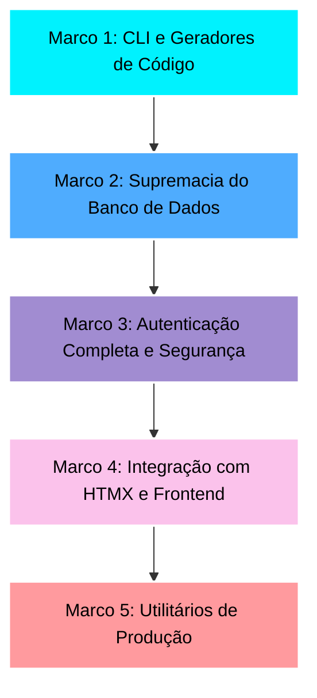

# Rullst Roadmap 🗺️
### *"O Caminho para o Framework Full-Stack de Rust Definitivo"*

*Read this in [English](./ROADMAP.md).*

Este roadmap descreve os marcos necessários para transformar o **Rullst** da sua versão MVP atual (v0.1.0) em um framework full-stack dominante, pronto para produção e focado em **Produtividade Emocional**.

Nossa estratégia de desenvolvimento segue a filosofia **"Developer Experience tipo Laravel, Performance tipo Rust"**.

---

## 🚀 O Plano Diretor do Rullst

---

## 🛠️ Marco 1: Poder do CLI (`cargo-rullst`)
**Objetivo:** Permitir scaffold e geração de código em segundos. Desenvolvedores não devem criar arquivos de boilerplate manualmente.

- [ ] **Geradores de Código:**
  - [ ] `cargo rullst make:controller <Nome>` - Gera um controller com as ações básicas de CRUD.
  - [ ] `cargo rullst make:model <Nome> [-m]` - Gera um model de Active Record e, opcionalmente, uma migration associada.
  - [ ] `cargo rullst make:middleware <Nome>` - Gera um middleware customizado compatível com Axum.
- [ ] **Ergonomia do Workspace:**
  - [ ] Melhorar a velocidade de compilação durante as execuções do CLI.
  - [ ] Suporte à flag `--api` para criar scaffolds de APIs REST sem frontend HTML.

---

## 🗄️ Marco 2: Supremacia do Banco de Dados (Migrations & Relacionamentos)
**Objetivo:** Capacitar o `rust-eloquent` e o `Rullst` a gerenciar esquemas relacionais complexos sem complicação.

> [!NOTE]
> **Divisão de Responsabilidades:**
> O trabalho pesado (parsers de esquema SQL, execução de migrations e macros de relacionamento) será desenvolvido diretamente dentro do repositório **`rust-eloquent`** para manter o ORM modular e atraente para toda a comunidade Rust.
> O **Rullst** irá envelopar essas funcionalidades com comandos amigáveis de CLI e injeção automática de conexões.

- [ ] **Motor de Migrations (no `rust-eloquent`):**
  - [ ] Definição de migrations em SQL puro ou através de DSL intuitiva.
  - [ ] Executores CLI integrados no Rullst:
    - [ ] `cargo rullst db:migrate` - Executa migrations pendentes.
    - [ ] `cargo rullst db:rollback` - Reverte o último lote de migrations.
    - [ ] `cargo rullst db:status` - Mostra o histórico de migrações aplicadas.
- [ ] **Relacionamentos Active Record (no `rust-eloquent`):**
  - [ ] Macros declarativas de relacionamento como `HasMany` e `BelongsTo`.
  - [ ] Resolução de associações `BelongsToMany` (Muitos para Muitos).
  - [ ] Mecanismos de Lazy e Eager loading para evitar problemas de consultas N+1.
- [ ] **Seeders e Factories:**
  - [ ] `cargo rullst db:seed` - Popula o banco de dados usando dados fakes pré-configurados.
  - [ ] Padrão de factories integrado para geração ágil de entidades de teste.

---

## 🔒 Marco 3: Autenticação & Segurança (Social & Local Auth)
**Objetivo:** Implementar autenticação robusta, segura e instantânea. Qualquer dev deve ser capaz de autenticar usuários de forma segura em minutos.

- [ ] **Autenticação Social via `rust-socialite`:**
  - [ ] Integrar a crate **[`rust-socialite`](https://crates.io/crates/rust-socialite)** (sua criação!) como o motor oficial de OAuth do framework.
  - [ ] Configurações out-of-the-box para Google, GitHub, Facebook, Twitter e provedores genéricos de OpenID.
  - [ ] Fluxo fluido: redirecionar para o provedor, tratar o callback e autenticar/registrar o usuário via Active Record.
- [ ] **Autenticação Local:**
  - [ ] Auxiliares embutidos para hashing seguro de senhas via Argon2/Bcrypt.
  - [ ] Middlewares customizados para sessões seguras baseadas em Cookies e Tokens (JWT).
- [ ] **O Comando "Mágico" de Auth:**
  - [ ] `cargo rullst auth` - Cria instantaneamente um sistema completo de login e registro contendo:
    - Controllers de Login, Registro e Reset de Senha.
    - Telas bonitas e responsivas (templates `html!`) pré-estilizadas.
    - Migration SQL para a tabela de `users`.
- [ ] **Padrões de Segurança Robustos:**
  - [ ] Proteção automática contra ataques CSRF em submissões de formulários HTML.
  - [ ] Middleware padrão de cabeçalhos de segurança (CORS, HSTS, X-Content-Type-Options).

---

## ⚡ Marco 4: HTMX & Interatividade
**Objetivo:** Combinar a simplicidade de Server-Side Rendering (SSR) com a fluidez de Single-Page Applications (SPAs).

- [ ] **Suporte de Primeira Classe ao HTMX:**
  - [ ] Helpers para verificar cabeçalhos de requisição do HTMX (`rullst::htmx::is_htmx(req)`).
  - [ ] Suporte nativo para renderização de templates parciais (renderizar apenas o componente modificado, sem carregar o layout inteiro).
  - [ ] Integração nativa e configuração automática do TailwindCSS na inicialização do projeto.

---

## 📦 Marco 5: Utilitários de Produção (Filas, Caching e Scheduler)
**Objetivo:** Fornecer os recursos fundamentais necessários para escalar aplicações reais em produção.

- [ ] **Filas & Tarefas em Segundo Plano:**
  - [ ] API unificada `rullst::queue` com suporte a SQLite (para dev local) e Redis (para produção).
  - [ ] Executores assíncronos (workers) rodando tarefas pesadas em background.
- [ ] **Camada de Cache:**
  - [ ] API unificada `rullst::cache` com drivers para In-Memory e Redis.
- [ ] **Agendador de Tarefas (Task Scheduler):**
  - [ ] Agendamento declarativo tipo Cron diretamente no `main.rs` (ex: `.schedule("0 0 * * *", limpeza_diaria)`).

---

## 🗺️ Estratégia de Execução

Nós avançaremos **marco por marco**, começando pelo **Marco 1** para lapidar nossos geradores no CLI. 

Quando estiver pronto para começar, escolha uma tarefa ou sugira qual componente criar a seguir! 🚀
