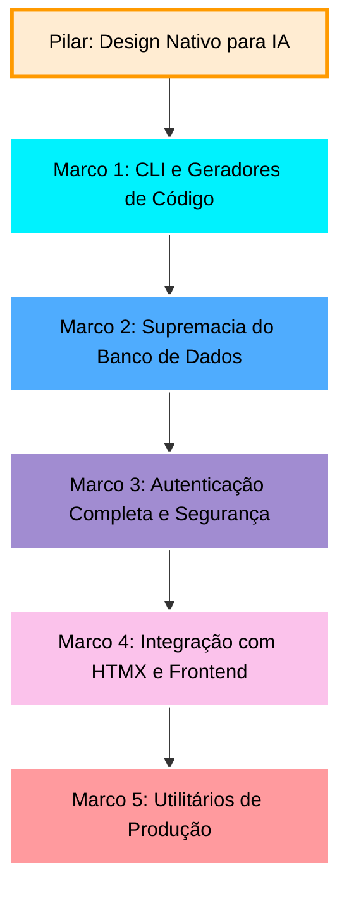

# Rullst Roadmap 🗺️
### *"O Caminho para o Framework Full-Stack de Rust Definitivo"*

*Read this in [English](./ROADMAP.md).*

Este roadmap descreve os marcos necessários para transformar o **Rullst** da sua versão MVP atual (v0.1.0) em um framework full-stack dominante, pronto para produção, focado em **Produtividade Emocional** e **Engenharia Nativa para IA**.

Nossa estratégia de desenvolvimento segue a filosofia **"Developer Experience de Laravel, Performance de Rust, Arquitetado para Humanos e IA"**.

---

## 🤖 O Paradigma Nativo para IA (Projetado para Humanos e Agentes de IA)

Quase todos os frameworks web modernos (Laravel, Ruby on Rails, Next.js) foram criados antes da era dos LLMs e Agentes de IA. Eles dependem fortemente de "mágica" em tempo de execução, reflexão dinâmica e implicitude complexa que confunde os codificadores de IA e geram alucinações.

**O Rullst foi projetado desde o primeiro dia para ser o primeiro framework web nativo para IA:**
1. **Zero Mágica em Runtime, Compilação Pura:** Macros declarativas de alto nível (`#[derive(Eloquent)]`, `routes!`) e a tipagem forte do Rust oferecem estruturas extremamente explícitas para assistentes de IA, eliminando alucinações de API e permitindo que a IA se autocorrija instantaneamente com as mensagens de erro do compilador.
2. **Scaffolding Rico em Contexto:** O comando `cargo rullst new` irá gerar automaticamente arquivos `.ai-rules` / `.cursorrules` otimizados. Qualquer agente de IA que abrir a pasta entenderá imediatamente as convenções exatas, estilo de código e APIs do Rullst, atingindo 100% de produtividade na hora.
3. **Descoberta Estruturada do Sistema:** Em modo de desenvolvimento, o Rullst gerará um esquema estrutural local (`rullst-schema.json`) detalhando todas as rotas, controllers e models ativos. Isso permite que agentes de IA mapeiem e entendam o projeto inteiro em milissegundos.

---

## 🚀 O Plano Diretor do Rullst

---

## 🛠️ Marco 1: Poder do CLI (`cargo-rullst`)
**Objetivo:** Permitir scaffold e geração de código em segundos. Desenvolvedores não devem criar arquivos de boilerplate manualmente.

- [x] **Geradores de Código:**
  - [x] `cargo rullst make:controller <Nome>` - Gera um controller com as ações básicas de CRUD.
  - [x] `cargo rullst make:model <Nome> [-m]` - Gera um model de Active Record e, opcionalmente, uma migration associada.
  - [x] `cargo rullst make:middleware <Nome>` - Gera um middleware customizado compatível com Axum.
  - [x] `cargo rullst make:cors` & `make:jwt` - Gera middlewares essenciais em Rust puro direto no seu projeto.
  - [x] `cargo rullst generate:openapi` - Geração de OpenAPI/Swagger guiada por IA, sem poluir o código com macros.
  - [x] `cargo rullst make:worker` - Scaffold para workers de background tasks.
- [x] **Ergonomia do Workspace:**
  - [x] Melhorar a velocidade de compilação durante as execuções do CLI.
  - [x] Suporte à flag `--api` para criar scaffolds de APIs REST sem frontend HTML.

---

## 🗄️ Marco 2: Supremacia do Banco de Dados (Migrations & Relacionamentos)
**Objetivo:** Capacitar o `rust-eloquent` e o `Rullst` a gerenciar esquemas relacionais complexos sem complicação.

> [!NOTE]
> **Divisão de Responsabilidades:**
> O trabalho pesado (parsers de esquema SQL, execução de migrations e macros de relacionamento) será desenvolvido diretamente dentro do repositório **`rust-eloquent`** para manter o ORM modular e atraente para toda a comunidade Rust.
> O **Rullst** irá envelopar essas funcionalidades com comandos amigáveis de CLI e injeção automática de conexões.

- [x] **Motor de Migrations (no `rust-eloquent`):**
  - [x] Definição de migrations em SQL puro ou através de DSL intuitiva.
  - [x] Executores CLI integrados no Rullst:
    - [x] `cargo rullst db:migrate` - Executa migrations pendentes.
    - [x] `cargo rullst db:rollback` - Reverte o último lote de migrations.
    - [x] `cargo rullst db:status` - Mostra o histórico de migrações aplicadas.
- [x] **Relacionamentos Active Record (no `rust-eloquent`):**
  - [x] Macros declarativas de relacionamento como `HasMany` e `BelongsTo`.
  - [x] Resolução de associações `BelongsToMany` (Muitos para Muitos).
  - [x] Mecanismos de Lazy e Eager loading para evitar problemas de consultas N+1.
- [x] **Seeders e Factories:**
  - [x] `cargo rullst db:seed` - Popula o banco de dados usando dados fakes pré-configurados.
  - [x] Padrão de factories integrado para geração ágil de entidades de teste.

---

## 🔒 Marco 3: Autenticação & Segurança (Social & Local Auth)
**Objetivo:** Implementar autenticação robusta, segura e instantânea. Qualquer dev deve ser capaz de autenticar usuários de forma segura em minutos.

- [x] **Autenticação Social via `rust-socialite`:**
  - [x] Integrar a crate **[`rust-socialite`](https://crates.io/crates/rust-socialite)** (sua criação!) como o motor oficial de OAuth do framework.
  - [x] Configurações out-of-the-box para Google, GitHub, Facebook, Twitter e provedores genéricos de OpenID.
  - [x] Fluxo fluido: redirecionar para o provedor, tratar o callback e autenticar/registrar o usuário via Active Record.
- [x] **Autenticação Local:**
  - [x] Auxiliares embutidos para hashing seguro de senhas via Argon2/Bcrypt.
  - [x] Middlewares customizados para sessões seguras baseadas em Cookies e Tokens (JWT).
- [x] **O Comando "Mágico" de Auth:**
  - [x] `cargo rullst auth` - Cria instantaneamente um sistema completo de login e registro contendo:
    - Controllers de Login, Registro e Reset de Senha.
    - Telas bonitas e responsivas (templates `html!`) pré-estilizadas.
    - Migration SQL para a tabela de `users`.
- [x] **Padrões de Segurança Robustos:**
  - [x] Proteção automática contra ataques CSRF em submissões de formulários HTML.
  - [x] Middleware padrão de cabeçalhos de segurança (CORS, HSTS, X-Content-Type-Options).

---

## ⚡ Marco 4: HTMX & Interatividade
**Objetivo:** Combinar a simplicidade de Server-Side Rendering (SSR) com a fluidez de Single-Page Applications (SPAs).

- [x] **Suporte de Primeira Classe ao HTMX:**
  - [x] Helpers para verificar cabeçalhos de requisição do HTMX (`rullst::htmx::is_htmx(req)`).
  - [x] Suporte nativo para renderização de templates parciais (renderizar apenas o componente modificado, sem carregar o layout inteiro).
  - [x] Integração nativa e configuração automática do TailwindCSS na inicialização do projeto.

---

## 📦 Marco 5: Utilitários de Produção (Filas, Caching e Scheduler)
**Objetivo:** Fornecer os recursos fundamentais necessários para escalar aplicações reais em produção.

- [x] **Docker e Containerização:**
  - [x] Flag `cargo rullst new <nome> --docker` para gerar um `Dockerfile` pronto para produção.
  - [x] Geração automática de `docker-compose.yml` para desenvolvimento local (App + DB + Redis).
  - [x] Builds multi-stage otimizados (`scratch` / `distroless`) para deploys em Rust ultra-leves, rápidos e seguros.
- [x] **Filas & Tarefas em Segundo Plano:**
  - [x] API unificada `rullst::queue` com suporte a SQLite (para dev local) e Redis (para produção).
  - [x] Executores assíncronos (workers) rodando tarefas pesadas em background.
- [x] **Camada de Cache:**
  - [x] API unificada `rullst::cache` com drivers para In-Memory e Redis.
- [x] **Agendador de Tarefas (Task Scheduler):**
  - [x] Agendamento declarativo tipo Cron diretamente no `main.rs` (ex: `.schedule("0 0 * * *", limpeza_diaria)`).

---

## 🏢 Marco 6: Funcionalidades Enterprise
**Objetivo:** Entregar os recursos robustos clássicos esperados de frameworks focados em empresas.

- [x] **Validação Declarativa:** Uma macro `#[derive(Validate)]` para DTOs/structs que retorna automaticamente JSON 422 para APIs ou componentes HTMX com erros para formulários.
- [x] **Sistema de E-mail (`rullst::mail`):** API fluente para envio de e-mails com drivers para SMTP, Resend e SendGrid, suportando templates nativos com a macro `html!`.
- [x] **Abstração de Armazenamento (`rullst::storage`):** API unificada para uploads e gerenciamento de arquivos com drivers para Local (Disco), AWS S3 e Cloudflare R2.
- [x] **WebSockets & Tempo Real:** Suporte nativo a WebSockets no roteador, perfeitamente integrado com a extensão HTMX (`hx-ext="ws"`).
- [x] **Rullst Horizon:** Um dashboard web embutido lindíssimo para monitorar filas, visualizar jobs que falharam e tentar executá-los novamente.

---

## 🚀 Marco 7: A "Vantagem Injusta" (Domínio Absoluto)
**Objetivo:** Ir além do que é possível em outras linguagens, tornando o Rullst o rei inquestionável do desenvolvimento web moderno.

- [ ] **Rullst Live (Server-Driven UI):** Inspirado no Phoenix LiveView e Laravel Livewire. Escreva componentes Rust com estado que sincronizam automaticamente com o navegador via WebSockets. Interatividade de SPA sem escrever uma única linha de JavaScript.
- [x] **Core IA Nativo (`rullst::ai`):** Abstrações declarativas embutidas para LLMs (OpenAI, Gemini, Anthropic, Ollama), Bancos de Dados Vetoriais e Agentes IA. Crie aplicações com RAG em minutos.
- [ ] **Rullst Studio:** Uma interface visual nativa para inspecionar, filtrar e editar os registros do seu banco de dados localmente (estilo Prisma Studio). Ativado via `cargo rullst studio`.
- [ ] **Testes E2E Declarativos:** API fluente de testes no estilo Laravel: `app.get("/login").assert_status(200).assert_see("Bem-vindo");`.
- [ ] **Feature Flags Nativas:** Suporte embutido para ligar/desligar funcionalidades e realizar Testes A/B sem dependências externas.
- [ ] **Wasm Islands (`#[client_component]`):** Escreva componentes frontend interativos diretamente em Rust. O Rullst compilará automaticamente esses blocos específicos para WebAssembly leve e os hidratará no cliente de forma transparente, eliminando a necessidade de qualquer linha de JavaScript!
- [ ] **Console de Erros "Self-Healing" com IA:** Tela interativa de erro em modo desenvolvimento (estilo Laravel Ignition) integrada a assistentes locais de IA. Quando um erro em runtime ou compilação acontecer, você terá um botão "Auto-Fix com Rullst AI" que aplicará o patch correto diretamente ao seu código-fonte.
- [ ] **SaaS Multi-Tenancy Nativo (`rullst::multitenant`):** Isolamento nativo de inquilinos (Multi-tenancy por subdomínio, cabeçalho ou esquema de DB) configurado declarativamente por meio de um único decorator/macro.
- [ ] **Hot Reloading via Dynamic Linking:** Redução drástica dos tempos de compilação em desenvolvimento por meio do carregamento dinâmico de bibliotecas (`dylib` / `.so`), permitindo alterar rotas e templates HTML com feedback instantâneo de sub-segundos.

---

## 🗺️ Estratégia de Execução

Seguiremos **marco por marco**, começando pelo **Marco 1** para polir nossos geradores de CLI.

Se estiver pronto para começar, selecione uma tarefa ou sugira qual componente construir a seguir! 🚀
