# 🧪 Monorepo Examples & Reference Applications

Rullst includes full-stack reference applications located in the [`examples/`](https://github.com/Rullst/Rullst/tree/main/examples) directory of the monorepo.

These applications serve as **live integration testbeds, CI/CD validation suites, and architectural references** demonstrating how all Rullst subsystems interact in a single production-ready codebase.

---

## 🆚 Monorepo Showcase vs. CLI Blueprints

It is critical to understand the distinct architectural roles of the **Monorepo Reference Showcase** (`examples/blog`) and the **CLI Starter Blueprints** (`cargo rullst new ... --blueprint blog`):

| Aspect | Monorepo Showcase (`examples/blog`) | CLI Scaffolding Blueprints (`cargo rullst new ... --blueprint blog`) |
| :--- | :--- | :--- |
| **Concept** | **"Kitchen Sink" / Living Testbed** of the framework. | **Clean Starter Boilerplate** for new commercial projects. |
| **Primary Goal** | Exercises **100% of Rullst crates and features** in a single autonomous binary. | Provides a **clean, idiomatic, noise-free foundation** for developers to build production apps immediately. |
| **Front-End Matrix** | Houses **all 3 paradigms simultaneously** (HTMX + LiveView WebSockets + Wasm Islands) to prove runtime interoperability. | Contains **only the frontend selected** by the developer during project creation (e.g. HTMX + Tailwind, React/Vite, Leptos SSR). |
| **Dependencies** | Local path monorepo crates (`path = "../../rullst"`). | Public published registry dependencies (`rullst = "12.0.0"` from crates.io). |
| **Included Features** | RASP attack sandboxes (`/security-demo`), Honeypots (`/wp-admin`), SPED NFS-e XMLDSig generator, and live mounted Studio & Nexus. | Production-ready MVC structure (`controllers/`, `models/`, `migrations/`, `pages/`) with zero clutter or demo artifacts. |
| **CI/CD Integration** | Primary binary compiled and executed in automated **DAST ZAP scans, E2E Smoke suites, and Codecov coverage**. | Scaffold generator validated independently in CLI unit tests. |

---

## 💡 Why This Separation is Essential (Zero Redundancy in Practice)

1. **Developers Want a Clean Slate, Not Demo Artifacts**:
   - When a developer bootstraps a new blog via `cargo rullst new my-blog --blueprint blog`, they expect a pristine production codebase.
   - If the starter template included SQL injection testing buttons, `/wp-admin` honeypots, or conflicting frontend paradigms, developers would have to waste hours deleting demo code before starting actual development.
   - The CLI blueprint delivers a **clean, production-grade starting point**.

2. **Framework Maintainers Need a Complete Living Lab**:
   - Framework maintainers and enterprise auditors need empirical proof that all decoupled crates (Security, ORM, Capital, AI, Live, Studio, Nexus) compile together without trait conflicts, panic paths, or memory leaks.
   - `examples/blog` acts as that **living testbed**, serving as the single source of truth for end-to-end integration health.

---

## 📖 "The Sovereign SaaS Blog & Publisher" Deep-Dive

The primary showcase application is located at [`examples/blog`](https://github.com/Rullst/Rullst/tree/main/examples/blog). It is a **100% real, non-mocked** implementation covering all flagship capabilities of Rullst.

```mermaid
graph LR
    subgraph Frontend [All 3 Front-End Paradigms]
        A1["Zero-Bundle HTMX SSR (/)"]
        A2["LiveView Server-Driven UI (/live-feed)"]
        A3["Wasm Reactive Island (/editor)"]
    end

    subgraph Backend [Core Subsystems]
        B1["Hybrid ORM (Active Record & Repository)"]
        B2["Capital SaaS & SPED Invoicing (/pricing)"]
        B3["Security RASP & Tarpit (/security-demo)"]
        B4["AI RAG Vector Search (/ai-assistant)"]
    end

    subgraph Panels [Control Rooms]
        C1["Studio Control Room (/studio)"]
        C2["Nexus Admin CMS (/nexus)"]
    end

    Frontend --> Backend
    Backend --> Panels
```



### Key Subsystems Demonstrated:

### 1. Zero-Bundle Server-Side Rendering (`html!`)
Ultra-fast HTML generation compiled into Axum static dispatch with zero runtime template parsing overhead:
- **Route**: `GET /`
- **Model**: `Post` Active Record entity saving directly to SQLite.

### 2. Multi-Tenant Task-Local Scoping
Automatic row-level database isolation injected per request from the `X-Tenant-ID` HTTP header:
```rust
impl PostQueryBuilder {
    pub fn apply_tenant_scope(self) -> Self {
        if let Some(tid) = rullst::multitenant::current_tenant_id() {
            self.where_eq("tenant_id", tid)
        } else {
            self
        }
    }
}
```

### 3. Real-Time WebSockets LiveView (`rullst::live`)
State synchronization and reactive DOM patches executing on Tokio worker threads with zero client-side JavaScript state:
- **Routes**: `GET /live-feed`, `GET /live-counter`, `WS /_live`
- **Component**: `CounterComponent` handling WebSocket event dispatches.

### 4. Wasm Islands in Pure Rust
Client-side micro-frontend reactivity where Rust compiles directly to WebAssembly (`wasm32-unknown-unknown`):
- **Routes**: `GET /editor`, `GET /wasm-counter`
- **Engine**: `wasm-bindgen` with zero VDOM overhead.

### 5. Data Mapper & Repository Pattern (`rullst-orm`)
Domain aggregations and analytics decoupled from underlying database tables:
- **Route**: `GET /posts/repository`
- **Implementation**: `PostRepository::get_author_analytics()` computing reading times and word counts via parameterized SQLx queries.
- **Intent-Based Modeling**: Live visualizer of `/// @index(tenant_id, title)` automated index migrations.

### 6. Capital SaaS Monetization & SPED Invoicing (`rullst-capital`)
Subscription tier quota management and native Brazilian Receita Federal fiscal invoicing:
- **Route**: `GET /pricing`, `GET /billing`
- **Quota Governance**: `Billable::check_quota` enforcing post publication limits across tiers.
- **Direct Fiscal Engine**: Real Declaração de Prestação de Serviços (DPS v1.0.0) XML generation with enveloped **W3C XMLDSig** RSA-SHA256 digital signatures at **R$ 0.00 intermediary fees**.

### 7. Interactive Security Sandbox & RASP (`rullst-security`)
Defense-in-depth security layer with live interactive attack testing:
- **Route**: `GET /security-demo`
- **RASP Engine**: Real-time inspection intercepting SQL Injection (`' OR '1'='1`) and Path Traversal (`../../../../etc/passwd`).
- **DLP Interceptor**: Response payload masking (`redact_secrets`) redacting API tokens and passwords.
- **Login Jail**: Tarpit delay engine applying progressive async backoff to brute-force attempts.
- **Honeypot Trap**: Route `GET /wp-admin` catching malicious crawlers and logging alerts to the SOC Threat Radar.

### 8. AI RAG & Vector Semantic Search (`rullst-ai`)
Local vector search and prompt safety filtering:
- **Route**: `GET /ai-assistant`
- **Vector Search**: Real-time **Cosine Similarity** ranking over blog embeddings.
- **Prompt Injection Defense**: Input sanitizer filtering adversarial jailbreak attempts.

### 9. Control Rooms: Studio & Nexus
- **Studio Developer Control Room**: Mounted at `/studio` (`/studio/radar`, `/studio/capital`, `/studio/security`, `/studio/traces`).
- **Nexus Admin CMS**: Mounted at `/nexus` (`/nexus/table/posts`, `/nexus/chat`).

---

## 🧭 Complete Route Catalog

| Route | Method | Subsystem | Description |
| :--- | :--- | :--- | :--- |
| `http://localhost:3000/` | `GET` | **HTMX SSR** | Landing feed with Active Record post creation form. |
| `http://localhost:3000/posts` | `POST` | **Active Record** | Saves a new post into SQLite under current tenant. |
| `http://localhost:3000/posts/repository` | `GET` | **Repository ORM** | Data Mapper analytics and Intent-Based `@index` visualizer. |
| `http://localhost:3000/live-feed` | `GET` | **LiveView** | Server-driven UI state synchronization over WebSockets. |
| `http://localhost:3000/editor` | `GET` | **Wasm Island** | Client-side reactive WebAssembly micro-frontend. |
| `http://localhost:3000/pricing` | `GET` | **Capital** | SaaS pricing tiers, `Billable` quota check & SPED DPS XMLDSig. |
| `http://localhost:3000/security-demo` | `GET` | **Security** | Interactive RASP, DLP masking & Login Jail tarpit sandbox. |
| `http://localhost:3000/ai-assistant` | `GET` | **AI & RAG** | Vector semantic search with Cosine Similarity & Prompt Shield. |
| `http://localhost:3000/wp-admin` | `GET` | **Honeypot** | Trap route triggering threat log to SOC Threat Radar. |
| `http://localhost:3000/studio` | `GET` | **Studio** | Developer Control Room (Database Inspector, Radar, Traces). |
| `http://localhost:3000/nexus` | `GET` | **Nexus** | Admin CMS with CRUD management and AI Assistant. |
| `http://localhost:3000/robots.txt` | `GET` | **SEO** | Auto-generated crawler directives. |
| `http://localhost:3000/sitemap.xml` | `GET` | **SEO** | XML sitemap metadata. |

---

## 🚀 Running the Showcase Locally

```bash
# Navigate to the blog example
cd examples/blog

# Start the server
cargo run
```

Access the showcase at `http://127.0.0.1:3000`.

### Testing Multi-Tenant Scoping:
```bash
# Request Enterprise Tenant
curl -s -H "X-Tenant-ID: tenant-enterprise" http://localhost:3000/ | grep "Enterprise Architecture"

# Request Startup Tenant
curl -s -H "X-Tenant-ID: tenant-startup" http://localhost:3000/ | grep "High-Velocity MVP"
```

---

## 🛡️ Automated Testing & CI/CD

The blog showcase is continuously tested on every commit:
- **E2E Smoke Suite**: [`.github/workflows/e2e-smoke.yml`](https://github.com/Rullst/Rullst/blob/main/.github/workflows/e2e-smoke.yml)
- **OWASP DAST ZAP Security Scan**: [`.github/workflows/dast-zap.yml`](https://github.com/Rullst/Rullst/blob/main/.github/workflows/dast-zap.yml)
- **LLVM Code Coverage (> 80%)**: [`.github/workflows/coverage.yml`](https://github.com/Rullst/Rullst/blob/main/.github/workflows/coverage.yml)
