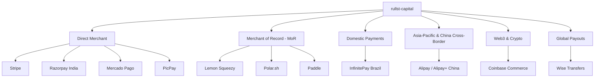

# 💳 Payment Gateways & Financial Infrastructure Guide

Rullst Capital (`rullst-capital`) provides typed payment, subscription, payout,
and webhook adapters. Unsupported operations return typed errors, and mock
credentials select deterministic offline behavior.

The provider modules share common traits, but they do not all implement every
operation. An adapter's presence is not a promise of geographic availability,
tax treatment, settlement time, pricing, or regulatory suitability.

---

## 🏛️ Provider Landscape & Strategic Archetypes



---

## 📊 Adapter inventory

| Adapter group | Included modules | Rullst contract |
| :--- | :--- | :--- |
| Direct payment APIs | Stripe, Mercado Pago, InfinitePay, PicPay, Razorpay | Implemented trait methods perform signed/credentialed requests; unsupported methods fail explicitly. |
| Merchant-of-record APIs | Lemon Squeezy, Polar, Paddle | Provider-specific checkout/subscription methods only; tax and merchant-of-record obligations remain governed by the provider contract. |
| Cross-border and wallets | Alipay | RSA2 operations that are not implemented fail closed; HMAC fixtures are not represented as RSA2. |
| Crypto commerce | Coinbase Commerce | Provider-specific charge and webhook flows; chain settlement is outside Rullst's trust boundary. |
| Payouts | Wise | Provider-specific payout operations; identity, compliance, currency, and availability checks remain external. |

Provider pricing and terms change. Check the provider's current official
documentation and the concrete trait implementation before selecting an adapter.

---

## 🔍 Selection model

Choose a provider only after checking which trait methods the Rullst adapter
implements, the currencies and countries enabled on the actual merchant account,
the current provider contract, webhook replay/idempotency requirements, and the
application's legal and tax responsibilities. Merchant-of-record status and tax
handling are external contractual properties, not guarantees made by Rullst.

---

## 💻 Rust Code Integration Examples

### 1. Initializing Your Preferred Gateway

In your `main.rs`:

```rust
use rullst_capital::{
    init_provider, StripeProvider, LemonSqueezyProvider, InfinitePayProvider,
    PolarProvider, PaddleProvider, MercadoPagoProvider, CoinbaseCommerceProvider,
    PicPayProvider, AlipayProvider, RazorpayProvider,
};

#[rullst::runtime::main]
async fn main() -> Result<(), Box<dyn std::error::Error>> {
    // Select your active provider:
    
    // Example A: InfinitePay for Brazilian operations (Pix 0% fee)
    init_provider(Box::new(InfinitePayProvider::new(
        std::env::var("INFINITEPAY_API_KEY")?,
        std::env::var("INFINITEPAY_WEBHOOK_SECRET")?,
    )));

    // Example B: Alipay for China & APAC Cross-Border E-Commerce
    // init_provider(Box::new(AlipayProvider::new(
    //     std::env::var("ALIPAY_APP_ID")?,
    //     std::env::var("ALIPAY_PRIVATE_KEY")?,
    //     std::env::var("ALIPAY_PUBLIC_KEY")?,
    // )));

    // Example C: Stripe for Global SaaS
    // init_provider(Box::new(StripeProvider::new(
    //     std::env::var("STRIPE_SECRET_KEY")?,
    //     std::env::var("STRIPE_WEBHOOK_SECRET")?,
    // )));

    // Example D: Polar.sh for Open-Source Devs
    // init_provider(Box::new(PolarProvider::new(
    //     std::env::var("POLAR_ACCESS_TOKEN")?,
    //     std::env::var("POLAR_WEBHOOK_SECRET")?,
    // )));

    Ok(())
}
```

### 2. Generating Checkout Sessions

```rust
use rullst_capital::provider;
use rullst::response::Redirect;

pub async fn start_checkout(customer_email: String, plan_id: String) -> Result<Redirect, String> {
    let p = provider().ok_or_else(|| "No billing provider configured".to_string())?;

    let checkout_url = p.create_checkout_session(
        &customer_email,
        &plan_id,
        "https://myapp.com/billing/callback",
    ).await?;

    Ok(Redirect::to(&checkout_url))
}
```

### 3. Cryptographically Verified Webhook Endpoint

Rullst Capital provides the `verify_webhook` middleware, which intercepts incoming requests, verifies HMAC signatures using constant-time comparisons (`subtle::ConstantTimeEq`), and passes a strongly-typed `WebhookEvent` into your handler:

```rust
use axum::{Router, routing::post, Extension};
use rullst_capital::{verify_webhook, WebhookEvent, SubscriptionStatus};

async fn handle_billing_event(Extension(event): Extension<WebhookEvent>) {
    match event.status {
        SubscriptionStatus::Active => {
            println!("🎉 Subscription activated for: {}", event.customer_email);
            // Grant premium access in database
        }
        SubscriptionStatus::Canceled => {
            println!("⚠️ Subscription canceled for: {}", event.customer_email);
            // Revoke access or downgrade plan
        }
        SubscriptionStatus::PastDue => {
            println!("🚨 Payment failed: {}", event.customer_email);
            // Trigger automated dunning email
        }
        _ => {}
    }
}

pub fn billing_routes() -> Router {
    Router::new()
        .route("/webhooks/capital", post(handle_billing_event))
        .layer(axum::middleware::from_fn(verify_webhook))
}
```

### 4. International Payouts with Wise

```rust
use rullst_capital::{init_payout_provider, payout_provider, WiseProvider, PayoutStatus};

pub async fn disburse_affiliate_commission(affiliate_email: &str, amount_usd_cents: u64) -> Result<(), String> {
    init_payout_provider(Box::new(WiseProvider::new(
        std::env::var("WISE_API_TOKEN").unwrap(),
        std::env::var("WISE_PROFILE_ID").unwrap(),
    )));

    if let Some(payout) = payout_provider() {
        let transfer_id = payout.create_transfer(affiliate_email, amount_usd_cents, "USD").await?;
        println!("Payout initiated! Transfer ID: {}", transfer_id);
    }

    Ok(())
}
```

---

## 🛡️ Security Guarantees

1. **Zero Allocations on Forged Requests**: Requests missing required signatures or providing malformed tokens are rejected with `401 Unauthorized` before reading request bodies into memory.
2. **Constant-Time Verification**: All cryptographic signatures use constant-time comparisons (`ConstantTimeEq`) to prevent side-channel timing attacks.
3. **No Dynamic Reflection**: All provider responses map into typed Rust enums and structs at compile time.
