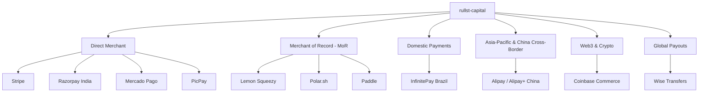

# 💳 Payment Gateways & Financial Infrastructure Guide

Rullst Capital (`rullst-capital`) provides typed payment, subscription, payout,
and webhook adapters. Unsupported operations return typed errors, and mock
credentials select deterministic offline behavior.

The provider modules share common traits, but they do not all implement every
operation. An adapter's presence is not a promise of geographic availability,
tax treatment, settlement time, pricing, or regulatory suitability.

---

## 🏛️ Provider Landscape & Strategic Archetypes



---

## 📊 Adapter inventory

| Adapter group | Included modules | Rullst contract |
| :--- | :--- | :--- |
| Direct payment APIs | Stripe, Mercado Pago, InfinitePay, PicPay, Razorpay | Implemented trait methods perform signed/credentialed requests; unsupported methods fail explicitly. |
| Merchant-of-record APIs | Lemon Squeezy, Polar, Paddle | Provider-specific checkout/subscription methods only; tax and merchant-of-record obligations remain governed by the provider contract. |
| Cross-border and wallets | Alipay | RSA2 operations that are not implemented fail closed; HMAC fixtures are not represented as RSA2. |
| Crypto commerce | Coinbase Commerce | Provider-specific charge and webhook flows; chain settlement is outside Rullst's trust boundary. |
| Payouts | Wise | Provider-specific payout operations; identity, compliance, currency, and availability checks remain external. |

Provider pricing and terms change. Check the provider's current official
documentation and the concrete trait implementation before selecting an adapter.

---

## 🔍 Selection model

Choose a provider only after checking which trait methods the Rullst adapter
implements, the currencies and countries enabled on the actual merchant account,
the current provider contract, webhook replay/idempotency requirements, and the
application's legal and tax responsibilities. Merchant-of-record status and tax
handling are external contractual properties, not guarantees made by Rullst.

---

## 💻 Rust Code Integration Examples

### 1. Initializing Your Preferred Gateway

In your `main.rs`:

```rust
use rullst_capital::{
    init_provider, StripeProvider, LemonSqueezyProvider, InfinitePayProvider,
    PolarProvider, PaddleProvider, MercadoPagoProvider, CoinbaseCommerceProvider,
    PicPayProvider, AlipayProvider, RazorpayProvider,
};

#[rullst::runtime::main]
async fn main() -> Result<(), Box<dyn std::error::Error>> {
    // Select your active provider:
    
    // Example A: InfinitePay for a configured Brazilian merchant account
    init_provider(Box::new(InfinitePayProvider::new(
        std::env::var("INFINITEPAY_API_KEY")?,
        std::env::var("INFINITEPAY_WEBHOOK_SECRET")?,
    )));

    // Example B: Alipay for China & APAC Cross-Border E-Commerce
    // init_provider(Box::new(AlipayProvider::new(
    //     std::env::var("ALIPAY_APP_ID")?,
    //     std::env::var("ALIPAY_PRIVATE_KEY")?,
    //     std::env::var("ALIPAY_PUBLIC_KEY")?,
    // )));

    // Example C: Stripe for Global SaaS
    // init_provider(Box::new(StripeProvider::new(
    //     std::env::var("STRIPE_SECRET_KEY")?,
    //     std::env::var("STRIPE_WEBHOOK_SECRET")?,
    // )));

    // Example D: Polar.sh for Open-Source Devs
    // init_provider(Box::new(PolarProvider::new(
    //     std::env::var("POLAR_ACCESS_TOKEN")?,
    //     std::env::var("POLAR_WEBHOOK_SECRET")?,
    // )));

    Ok(())
}
```

### 2. Generating Checkout Sessions

```rust
use rullst_capital::provider;
use axum::response::Redirect;
use rullst_capital::CapitalError;

pub async fn start_checkout(customer_email: String, plan_id: String) -> Result<Redirect, CapitalError> {
    let p = provider().ok_or_else(|| CapitalError::ConfigurationError(
        "No billing provider configured".to_string(),
    ))?;

    let checkout_url = p.create_checkout_session(
        &customer_email,
        &plan_id,
        "https://myapp.com/billing/callback",
    ).await?;

    Ok(Redirect::to(&checkout_url))
}
```

### 3. Cryptographically Verified Webhook Endpoint

Rullst Capital provides Axum and Actix Web adapters for one canonical webhook
verifier. It bounds the original payload, verifies the selected provider before
dispatch, restores the exact signed bytes, and passes a strongly typed
`WebhookEvent` into the handler. The production entry points reject empty and
`mock_*` webhook configuration.

```rust
use axum::{Router, routing::post, Extension};
use rullst_capital::{verify_webhook, WebhookEvent, SubscriptionStatus};

async fn handle_billing_event(Extension(event): Extension<WebhookEvent>) {
    match event.status {
        SubscriptionStatus::Active => {
            println!("🎉 Subscription activated for: {}", event.customer_email);
            // Grant premium access in database
        }
        SubscriptionStatus::Canceled => {
            println!("⚠️ Subscription canceled for: {}", event.customer_email);
            // Revoke access or downgrade plan
        }
        SubscriptionStatus::PastDue => {
            println!("🚨 Payment failed: {}", event.customer_email);
            // Trigger automated dunning email
        }
        _ => {}
    }
}

pub fn billing_routes() -> Router {
    Router::new()
        .route("/webhooks/capital", post(handle_billing_event))
        .layer(axum::middleware::from_fn(verify_webhook))
}
```

#### Actix Web adapter

Enable `rullst-capital` with `default-features = false, features = ["actix"]`,
or enable `rullst/capital-actix` through the umbrella crate. An explicit
provider-bound state avoids global provider configuration and makes the replay
boundary visible:

```rust,no_run
use actix_web::{App, HttpMessage, HttpRequest, HttpResponse, HttpServer, middleware, web};
use rullst_capital::{
    InMemoryWebhookReplayStore, StripeProvider, WebhookEvent,
    WebhookMiddlewareState, verify_webhook_actix_with_state,
};
use std::sync::Arc;

async fn handle_billing_event(request: HttpRequest) -> HttpResponse {
    let Some(event) = request.extensions().get::<WebhookEvent>().cloned() else {
        return HttpResponse::InternalServerError().finish();
    };
    // Apply an idempotent subscription transition using `event`.
    HttpResponse::NoContent().finish()
}

async fn serve() -> std::io::Result<()> {
    let provider = Arc::new(StripeProvider::new(
        "sk_live_from_secret_store",
        "whsec_from_secret_store",
    ));
    let replay = Arc::new(InMemoryWebhookReplayStore::default());
    let state = WebhookMiddlewareState::production_with_provider(provider, replay);

    HttpServer::new(move || {
        App::new()
            .app_data(web::Data::new(state.clone()))
            .wrap(middleware::from_fn(verify_webhook_actix_with_state))
            .route("/webhooks/capital", web::post().to(handle_billing_event))
    })
    .bind(("127.0.0.1", 8080))?
    .run()
    .await
}
```

The in-memory replay store is atomic only inside one process. Before applying
billing side effects in a multi-instance deployment, claim the provider event
ID through a durable database or Redis uniqueness transaction and make the
state transition idempotent.

### 4. Payment-Bound PDF Invoice Delivery

With the umbrella `capital-mail` feature, bind an authoritative invoice to the
final charge receipt and prepare a pipeline-validated HTML/PDF message through
`rullst::mail::PaidInvoiceDelivery`. Non-final/mock receipts and mismatched
recipient, minor-unit total or currency fail before delivery. Persist the
stable delivery key under a unique constraint before calling `send`; the
bridge is at-least-once and does not infer webhook reconciliation.

The complete runnable shape and its outbox boundary are shown in
[Tutorial 19](tutorials/19-saas-billing-capital.md#4-render-and-deliver-the-invoice-only-after-final-success).

### 5. International Payouts with Wise

```rust
use rullst_capital::{CapitalError, WiseProvider};

pub async fn disburse_affiliate_commission(
    provider: &WiseProvider,
    affiliate_email: &str,
    amount_usd_cents: u64,
) -> Result<String, CapitalError> {
    provider
        .send_payout(affiliate_email, amount_usd_cents, "USD", "affiliate commission")
        .await
}
```

---

## 🛡️ Security controls and boundaries

1. **Bounded verification:** webhook handlers should bound the body before
   parsing and reject a missing or malformed signature. Reading and parsing still
   allocate according to the concrete HTTP stack and payload.
2. **Cryptographic verification:** supported webhook adapters use HMAC or
   constant-time verification for the exact signed bytes. Each provider's
   timestamp/replay policy and deployed secret lifecycle still require review.
   The default replay store is process-local; multi-instance deployments need a
   durable shared idempotency boundary owned by the application.
3. **Typed parsing:** supported provider responses map into Rust enums and
   structs without runtime reflection. A typed response does not establish
   authorization, idempotency, or correctness of the upstream service.
