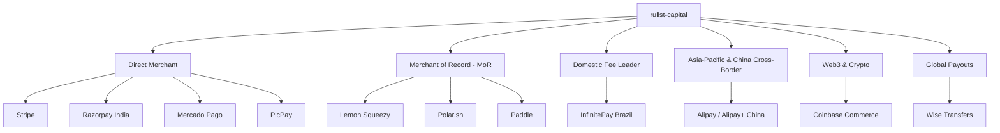

# 💳 Payment Gateways & Financial Infrastructure Guide

Rullst Capital (`rullst-capital`) provides a unified, zero-panic financial engine for monetizing SaaS, apps, and digital platforms.

Rather than locking developers into a single payment processor, Rullst offers a **carefully curated suite of payment providers** covering global markets, automated tax compliance (Merchant of Record), domestic fee optimization, developer monetization, Web3 crypto, and international B2B payouts.

---

## 🏛️ Provider Landscape & Strategic Archetypes



---

## 📊 Comprehensive Provider Comparison

| Provider | Archetype / Region | Transaction Fees | Payout Speed | Tax Handling (VAT / Sales Tax) | Best Used For |
| :--- | :--- | :--- | :--- | :--- | :--- |
| 🌐 **Stripe** | Global Direct Merchant | ~2.9% + $0.30 | 2 business days | Direct calculation (via Stripe Tax) | High-volume global SaaS, enterprise subscriptions, customer portals. |
| 🍋 **Lemon Squeezy** | Global Merchant of Record (MoR) | ~5.0% + $0.50 | Weekly / Bi-weekly | **Automatic (MoR handles 100% of global taxes)** | Solo developers, bootstrapped startups selling internationally without foreign entities. |
| 🇧🇷 **InfinitePay** | Brazil (CloudWalk Domestic) | **Pix: 0.00% (Zero)**<br>Card: ~0.75% to 1.44% | **Instant (D+0 / D+1)** | Domestic NF-e integration | Brazilian SaaS, low-margin platforms, high-volume domestic e-commerce. |
| ⚡ **Polar.sh** | Developer-First MoR & Open Source | ~4.0% + $0.40 | Monthly / On-demand | **Automatic (MoR)** | Monetizing GitHub repos, software licenses, developer micro-SaaS, and backer tiers. |
| 🛡️ **Paddle** | Enterprise Global MoR | ~5.0% + $0.50 | Monthly | **Automatic (MoR)** | European & US B2B enterprise SaaS with quote-to-cash workflows. |
| 🇨🇳 **Alipay** | China & APAC Cross-Border (Alipay+) | ~1.5% to 2.8% | Instant / T+1 | Cross-border customs & VAT compliance | China consumer market (> 1.3B users), cross-border checkouts, and APAC digital wallets. |
| 🇮🇳 **Razorpay** | India & Southeast Asia | ~2.0% + GST | 2 to 3 days | Domestic GST compliance | Recurring UPI autopay, Indian credit cards, net banking, and Asian subscriptions. |
| 🌎 **Mercado Pago** | Latin America (Regional) | ~3.99% to 4.98% | Instant | Domestic fiscal compliance | Broad Latin American coverage across Argentina, Mexico, Chile, Colombia, and Brazil. |
| ₿ **Coinbase Commerce** | Global Web3 / Crypto | ~1.0% | On-chain instant | None (Crypto self-custody) | Borderless crypto subscriptions (Bitcoin, Ethereum, Solana, USDC/USDT). |
| 📱 **PicPay** | Brazil Digital Wallet & QR Code | ~2.99% to 3.99% | Instant | Domestic fiscal compliance | Mobile consumer apps and direct digital wallet checkouts in Brazil. |
| 💸 **Wise** | Global Multi-Currency Payouts | Low FX conversion fees (~0.4%) | Instant / Same-day | N/A (Payouts & Disbursements) | Automated payouts to international contractors, creators, and affiliates across 40+ currencies. |

---

## 🔍 Why Were These Gateways Selected?

### 1. Direct Merchant vs. Merchant of Record (MoR)
- **Direct Merchant (Stripe, Mercado Pago, InfinitePay, Alipay)**: You are the seller on record. You receive funds directly into your bank account and are responsible for collecting, filing, and paying local taxes. You enjoy the **lowest transaction fees**.
- **Merchant of Record - MoR (Lemon Squeezy, Polar.sh, Paddle)**: The provider acts as the legal reseller of your software. They handle EU VAT, US state sales tax compliance, currency conversions, and fraud liability. In exchange for a slightly higher fee, you can sell worldwide without forming legal entities in multiple countries.

### 2. Why InfinitePay for Brazil?
- **Pix at 0.00% fee**: Pix is the dominant payment method in Brazil. InfinitePay provides 100% zero-fee Pix processing with instant settlement.
- **Lowest Domestic Credit Card Rates**: While global gateways charge ~3.99% + fixed fee for Brazilian cards, InfinitePay charges ~0.75% to 1.44% and allows transparent pass-through of installment interest (parcelamento em até 12x).

### 3. Why Alipay for China & Asia-Pacific?
- **China's Dominant Super-App Ecosystem**: With over 1.3 billion active users, Alipay (Ant Group) is essential for software and SaaS platforms selling to Chinese consumers and Asian digital wallet ecosystems (Alipay+ connecting Kakao Pay, GCash, Touch 'n Go, TrueMoney, DANA).

### 4. Why Polar.sh for Developers?
- Built natively for software engineers. Deep integration with GitHub organizations, issue funding, repository sponsor tiers, and license key generation.

### 5. Why Coinbase Commerce for Crypto?
- Eliminates cross-border banking restrictions and credit card fraud chargebacks. Accepts Bitcoin, Ethereum, Solana, and stablecoins (USDC/USDT) with automated on-chain webhook confirmations.

### 6. Why Wise for Payouts?
- Most SaaS platforms eventually need to disburse earnings to international creators, affiliates, or remote contractors. Wise provides market mid-rate exchange rates with transparent batch transfer APIs.

---

## 💻 Rust Code Integration Examples

### 1. Initializing Your Preferred Gateway

In your `main.rs`:

```rust
use rullst_capital::{
    init_provider, StripeProvider, LemonSqueezyProvider, InfinitePayProvider,
    PolarProvider, PaddleProvider, MercadoPagoProvider, CoinbaseCommerceProvider,
    PicPayProvider, AlipayProvider, RazorpayProvider,
};

#[rullst::runtime::main]
async fn main() -> Result<(), Box<dyn std::error::Error>> {
    // Select your active provider:
    
    // Example A: InfinitePay for Brazilian operations (Pix 0% fee)
    init_provider(Box::new(InfinitePayProvider::new(
        std::env::var("INFINITEPAY_API_KEY")?,
        std::env::var("INFINITEPAY_WEBHOOK_SECRET")?,
    )));

    // Example B: Alipay for China & APAC Cross-Border E-Commerce
    // init_provider(Box::new(AlipayProvider::new(
    //     std::env::var("ALIPAY_APP_ID")?,
    //     std::env::var("ALIPAY_PRIVATE_KEY")?,
    //     std::env::var("ALIPAY_PUBLIC_KEY")?,
    // )));

    // Example C: Stripe for Global SaaS
    // init_provider(Box::new(StripeProvider::new(
    //     std::env::var("STRIPE_SECRET_KEY")?,
    //     std::env::var("STRIPE_WEBHOOK_SECRET")?,
    // )));

    // Example D: Polar.sh for Open-Source Devs
    // init_provider(Box::new(PolarProvider::new(
    //     std::env::var("POLAR_ACCESS_TOKEN")?,
    //     std::env::var("POLAR_WEBHOOK_SECRET")?,
    // )));

    Ok(())
}
```

### 2. Generating Checkout Sessions

```rust
use rullst_capital::provider;
use rullst::response::Redirect;

pub async fn start_checkout(customer_email: String, plan_id: String) -> Result<Redirect, String> {
    let p = provider().ok_or_else(|| "No billing provider configured".to_string())?;

    let checkout_url = p.create_checkout_session(
        &customer_email,
        &plan_id,
        "https://myapp.com/billing/callback",
    ).await?;

    Ok(Redirect::to(&checkout_url))
}
```

### 3. Cryptographically Verified Webhook Endpoint

Rullst Capital provides the `verify_webhook` middleware, which intercepts incoming requests, verifies HMAC signatures using constant-time comparisons (`subtle::ConstantTimeEq`), and passes a strongly-typed `WebhookEvent` into your handler:

```rust
use axum::{Router, routing::post, Extension};
use rullst_capital::{verify_webhook, WebhookEvent, SubscriptionStatus};

async fn handle_billing_event(Extension(event): Extension<WebhookEvent>) {
    match event.status {
        SubscriptionStatus::Active => {
            println!("🎉 Subscription activated for: {}", event.customer_email);
            // Grant premium access in database
        }
        SubscriptionStatus::Canceled => {
            println!("⚠️ Subscription canceled for: {}", event.customer_email);
            // Revoke access or downgrade plan
        }
        SubscriptionStatus::PastDue => {
            println!("🚨 Payment failed: {}", event.customer_email);
            // Trigger automated dunning email
        }
        _ => {}
    }
}

pub fn billing_routes() -> Router {
    Router::new()
        .route("/webhooks/capital", post(handle_billing_event))
        .layer(axum::middleware::from_fn(verify_webhook))
}
```

### 4. International Payouts with Wise

```rust
use rullst_capital::{init_payout_provider, payout_provider, WiseProvider, PayoutStatus};

pub async fn disburse_affiliate_commission(affiliate_email: &str, amount_usd_cents: u64) -> Result<(), String> {
    init_payout_provider(Box::new(WiseProvider::new(
        std::env::var("WISE_API_TOKEN").unwrap(),
        std::env::var("WISE_PROFILE_ID").unwrap(),
    )));

    if let Some(payout) = payout_provider() {
        let transfer_id = payout.create_transfer(affiliate_email, amount_usd_cents, "USD").await?;
        println!("Payout initiated! Transfer ID: {}", transfer_id);
    }

    Ok(())
}
```

---

## 🛡️ Security Guarantees

1. **Zero Allocations on Forged Requests**: Requests missing required signatures or providing malformed tokens are rejected with `401 Unauthorized` before reading request bodies into memory.
2. **Constant-Time Verification**: All cryptographic signatures use constant-time comparisons (`ConstantTimeEq`) to prevent side-channel timing attacks.
3. **No Dynamic Reflection**: All provider responses map into typed Rust enums and structs at compile time.
