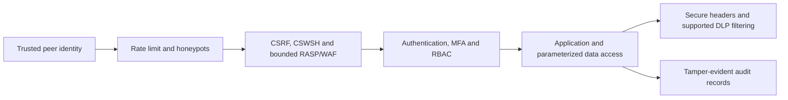

# Security architecture and boundaries

> **Vision preserved:** unfinished enterprise controls and absolute former claims
> remain visible, with a recommendation for each, in the
> [capability ledger](capability-ledger.md#security-authentication-studio-and-nexus).

`rullst-security` contains composable controls for HTTP applications. The crate
does not install every control automatically and does not replace secure domain
logic, a trusted reverse proxy, operating-system hardening, or independent
security testing.

## Defense in depth

Each arrow is an application integration point. If a layer is not mounted, its
counter and API being present in the crate do not protect traffic.

## Canonical production preset

`ProductionPreset::middleware_order()` is the v12 machine-readable ordering
contract. From the outermost inbound boundary to the handler, the order is:

1. trusted-proxy policy;
2. request-body limit;
3. request ID;
4. tracing;
5. secure headers;
6. explicit CORS allowlist;
7. bounded WAF/RASP;
8. CSRF;
9. session validation;
10. authentication;
11. tenant membership resolution;
12. role, permission and object-ownership authorization;
13. identity/direct-peer rate limit;
14. application handler.

Tower response flow unwinds in reverse, so the secure-header layer still
observes and protects responses returned by the inner guards and handler.
`Server` mounts the framework-owned staging/production baseline. Session,
authentication, tenant membership and authorization are deliberately
application-owned: the framework cannot infer those policies without creating
an insecure universal default. Generated applications must mount those layers
in the declared slots, and protected parameterized routes must still perform an
object-level ownership check.

The direct socket peer is the default network identity. A deployment must not
accept `Forwarded` or `X-Forwarded-For` until its exact proxy hops are configured
and tested. Body limits must be outer to any middleware that buffers content.
Webhook routes may bypass browser CSRF only by exact path and only when their
provider signature middleware is mandatory.

### Parameterized-route access contract

`cargo rullst audit --idor` requires every recognized parameterized route to
carry an adjacent `// rullst-access: public|owner|role|admin — reason` marker.
`public` is accepted only for a recognized GET route. `owner` requires
`RbacGuard::authorize_owner_or_role`; `role` requires a recognized role guard;
and `admin` requires `RequireRoleLayer` or
`NexusAuthPolicy::protect_router`. The latter lets application operational
routes reuse the same fail-closed peer/credential and administrator boundary as
Nexus.

The marker records intent and the scanner catches common omissions; neither is
a proof of domain ownership. Protected object routes still need negative HTTP
tests in which an authenticated subject requests another subject's resource and
receives a denial before data or side effects are exposed.

## Control map

| Risk area | Available primitives | Boundary |
| --- | --- | --- |
| Broken access control | `RbacGuard`, ownership helpers, authenticated user context. | The application must apply a check to every protected object and operation. |
| Cryptographic storage | AES-256-GCM field encryption and zeroizing secret wrappers. | Operators own key generation, storage, rotation, separation, and recovery. |
| Injection | SQLx binds, strict identifier validation, sanitizer and bounded RASP patterns. | Heuristics are not a complete language parser; domain validation and parameterization remain mandatory. |
| Misconfiguration | Nonce-based CSP and a strict HTTP-header baseline. | Proxies and page content change the deployed policy; no scanner grade is guaranteed. |
| Authentication abuse | Login jail, rate limiter, timing helpers, TOTP and WebAuthn integration. | Account recovery, RP/origin configuration, trusted peer identity, and capacity planning remain application concerns. |
| Data integrity | HMAC audit records with canonical encoding and sequence verification. | Durability, deletion resistance, key protection, and independent verification require external storage and operations. |
| Data leakage | Text-aware DLP, PII masking, and log redaction helpers. | Unsupported content types, encodings, streams, and oversize bodies follow explicit policy and must be tested. |
| AI input risk | Prompt-injection heuristics and PII masking in the high-level AI client. | No heuristic can prove a prompt safe or guarantee detection of every secret. |

This is a control mapping, not a claim of complete OWASP Top 10 coverage.

## Identity and network trust

Rate limiting, bans, honeypots, and audit attribution use the direct peer address
unless a trusted-proxy policy explicitly accepts forwarded metadata. Never trust
`X-Forwarded-For`, tenant headers, or role headers directly from an arbitrary
client. Tenant membership and roles must come from an authenticated session or a
cryptographically trusted internal gateway.

## Request and response inspection

RASP/WAF rules are bounded to avoid uncontrolled CPU or memory work. They can
reject known suspicious patterns in supported URI, header, and bounded body data,
but application queries must still use binds and access control.

DLP modifies only supported textual responses whose body can be safely buffered
within configured limits. Applications must test JSON, HTML, binary, compressed,
SSE, streaming, and oversized responses so headers and bodies remain
protocol-correct.

## Audit chains

Audit records use an unambiguous canonical representation and a non-empty HMAC
key. Verification must cover the ordered sequence, not just isolated records. A
valid chain is tamper-evident; it cannot stop an attacker who can delete every
record or steal the key. Store the log and key in separate protected systems.

## Supply-chain and compliance evidence

Repository workflows can run dependency policy, RustSec, CodeQL, fuzzing,
sanitizers, SemVer checks, SBOM generation, and release attestations. Their scope
and blocking status are defined by the workflow files. Informational checks must
not be described as formal gates.

Neither those workflows nor this crate certify an application for SOC 2, ISO
27001, PCI DSS, FedRAMP, or any OWASP level. See `AUDIT.md` and
`SECURITY_COMPLIANCE.md` for reproduction and evidence requirements.

## Deployment checklist

- Mount middleware in a tested order and use exact webhook CSRF exemptions.
- Configure secure session, webhook, audit, and encryption keys; reject weak or
  empty live credentials.
- Define trusted proxies and use the direct peer as the default identity.
- Apply owner/tenant/role checks server-side for every data operation.
- Validate per-response CSP nonces against rendered pages.
- Export telemetry and audit records to durable, access-controlled storage.
- Run negative integration tests and an independent security review for the
  application's actual configuration.
