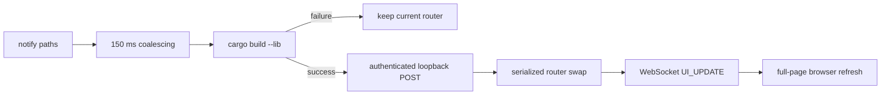

# Authenticated Development Hot Reload

Rullst v12 offers an explicit hot-reload profile for local debug development.
It rebuilds an application dynamic library, atomically replaces the serving
router after a successful build, and refreshes connected browsers. It is
designed to fail closed and to describe its measured behavior honestly.

## Generate the explicit profile

Choose hot reload in the interactive project wizard, or pin it in a
deterministic scaffold:

```bash
cargo rullst new learning-app --default --blueprint blank \
  --database sqlite --hot-reload --skip-initial-migration
cd learning-app
cargo rullst dev
```

`--hot-reload` adds a `cdylib`/`rlib` library target and the explicit
`rullst_router_init` development boundary. The CLI checks for both before
activating swaps. A project without that profile still starts normally, but the
CLI reports that source swapping is disabled.

Use the interactive control surface instead when you want bounded log panes,
status probes, search, filtering, and shortcuts:

```bash
cargo rullst dash
```

## What happens after a save



The AST comparison distinguishes a view-only edit from other Rust changes for
the diagnostic message. Both paths still perform a real incremental Rust build;
Rullst does not describe view edits as compilation-free.

The CLI prints the observed build-plus-swap duration. Warm incremental builds
are normally faster than cold builds, but the result depends on the crate graph,
linker, cache, toolchain, host, and code change. There is no universal
sub-millisecond guarantee.

## Failure behavior

| Event | Behavior |
|---|---|
| Rust compilation fails | The bounded compiler diagnostic is shown and the prior router keeps serving. |
| Reload endpoint returns non-2xx | No browser refresh is broadcast; the prior router remains active. |
| Reload request exceeds five seconds | The attempt fails and is reported without claiming success. |
| Two saves arrive together | Paths are merged, deduplicated, and compiled as one candidate generation. |
| A swap is already running | The next authenticated swap waits on the reload lock. |
| 64 library handles are retained | Further swaps return `503`; restart the development command to release them. |

Old library handles are deliberately retained because an in-flight request can
still be executing their code. Unloading such code would be unsafe. The finite
generation ceiling bounds this development trade-off.

## Local security boundary

At startup, the CLI creates a fresh 64-character hexadecimal token (256 bits)
and passes it only to the child application through `RULLST_HMR_TOKEN`. The
internal swap route requires that token in `x-rullst-hmr-token` and compares it
in constant time. Missing, malformed, or incorrect tokens receive `403`.

The browser-notification WebSocket shares the application's origin and port, so
the default `connect-src 'self'` policy permits it without a CSP exception. A
development server binds to loopback by default; explicitly overriding its host
also exposes this notification-only channel wherever the application listens.
Its client script is served by the application with `Cache-Control: no-store`;
hot reload does not fetch Morphdom or another runtime from a CDN. The browser
channel can request only a page refresh—it cannot load a library or authorize a
swap.

HTML with a known body size up to 10 MiB receives the development client.
Streaming HTML and responses declared above that bounded injection limit pass
through unchanged, so those pages do not receive automatic browser refresh.

Never expose or reuse `RULLST_HMR_TOKEN`, and never enable this development
boundary in production. Rullst Core also rejects hot reload outside a debug
build and a development-capable environment.

## State and ABI limitations

The swap preserves in-flight request safety; it does not promise to migrate
arbitrary application state into the new router. Process-global resources and
external services remain application responsibilities. The browser performs a
full-page refresh, so unsaved DOM-only state is not preserved unless the
application persists it explicitly.

The dynamic entry point uses Rust types and must be built by a compatible Rullst
and Rust toolchain. It is a first-party development mechanism, not a stable C
ABI or a general third-party plugin system.

## Troubleshooting

- **“source swapping is disabled”**: the project lacks either the `cdylib`
  target or `rullst_router_init`; regenerate an appropriate starter with
  `--hot-reload` rather than hand-editing only one half of the contract.
- **browser does not refresh**: confirm the page can open the same-origin
  `/_rullst_hmr` WebSocket and that a proxy forwards WebSocket upgrades. No
  second development port is required.
- **reload returns `403`**: start the application through `cargo rullst dev` or
  `cargo rullst dash`. Manual calls do not receive the private session token.
- **reload returns `503` after many edits**: restart the development command to
  release retained library generations.
- **dynamic-library load error after a toolchain change**: stop the development
  process and rebuild the application with one consistent Rust/Rullst toolchain.
  Do not copy a library built by another toolchain into the target directory.

## Motion and terminal accessibility

The hot-reload semantics are identical in `dev` and `dash`. Dashboard animation
can be disabled while retaining color:

```bash
RULLST_REDUCED_MOTION=1 cargo rullst dash
```

For a static color-free terminal, use:

```bash
NO_COLOR=1 cargo rullst dash
```

For CI or redirected output, use `cargo rullst dev`; the full-screen dashboard
requires an interactive terminal.
