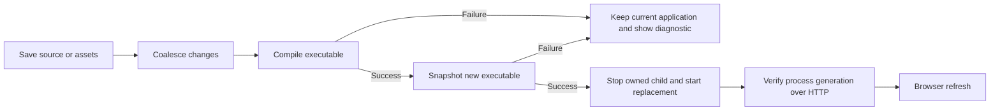

# Supervised Development Auto-Reload

> Release-audit follow-up: the implementation and final workspace validation are
> still in progress. See the [audit evidence](../v12-release-audit.md); this
> tutorial is not a claim that the current branch is already release-ready.

Rullst v12's development command rebuilds and restarts a directly linked
application. This keeps Tokio, ORM pools, sessions and other process globals in
one runtime. It replaces the advertised DLL-swap profile after Windows/LMS
testing exposed an uninitialized ORM in the loaded library.

## Run the development loop

Generate a normal application and use either development command:

```bash
cargo rullst new learning-app --default --blueprint blank \
  --database sqlite --skip-initial-migration
cd learning-app
cargo rullst dev
# Or, in an interactive terminal:
cargo rullst dash
```

There is no hot-reload question in the v12 wizard. Both commands supervise
reloads automatically; use `cargo run` for ordinary execution.

## What a save does



The watcher observes source, static assets, templates and manifest/configuration
files, including atomic editor renames. It excludes build outputs, Git data and
runtime database/log files. Events while a build is running remain pending for
a later rebuild. Saving CSS also triggers this conservative rebuild/restart
path; no compilation-free claim is made.

Initial migrations run before the first start when the generated migration
directory exists. Later migrations are explicit: use the dashboard migration
action or `cargo rullst db:migrate`. The dashboard queues migrations through the
supervisor, using its current executable snapshot with bounded output and
cancellation cleanup; the action is serialized with rebuilds. It does not compile
an unsaved or unbuilt migration into that snapshot. Restarting a process does
not apply arbitrary database-schema changes safely.

## Failure and state boundaries

| Event | Behavior |
| --- | --- |
| Compiler error | Keep the current process running; retain bounded diagnostics. |
| Snapshot copy/create error | Keep the current process running and report the failure before stopping anything. |
| Successful build | Snapshot the executable, stop the owned child, start the replacement. |
| Replacement cannot spawn | Attempt to restart the prior executable snapshot and report the error. |
| Replacement exits during startup | Report the exit; save a correction to rebuild and retry. |
| Readiness cannot be verified in 15 seconds | Report the limitation; do not claim successful readiness. |
| Dashboard exit / Ctrl+C | Cancel owned build/migration work and terminate/reap the application, subject to the Windows descendant limitation below. |
| Configured port changes | Restart the CLI so its dashboard/readiness target follows the new port. |

The old binary is copied before execution so Windows does not lock Cargo's
output during the next build. Cleanup targets only the snapshot created by
this supervisor. On Unix the child receives a two-second shutdown interval,
followed by termination of its owned process group if needed; group cleanup
precedes reaping the leader. Windows uses best-effort tree termination: without
Job Objects it cannot guarantee cleanup of orphan descendants after their
parent has exited, and it does not promise graceful request drain.

All process-local state resets, including in-memory sessions/queues/caches.
Persist important state explicitly. In-flight requests may be interrupted.
This is a local development loop, not zero-downtime production deployment.

## Browser and security boundary

The debug/development server serves a local reload script and an opaque
generation marker under `/_rullst/dev-*`. The script polls the same origin
and refreshes only after a different valid generation responds. Readiness
checks match the child generation rather than trusting any service on the port.
The marker is not a secret or an authentication credential. These endpoints
cannot instruct the server to compile, launch a process, or swap a library.

Eligible full-document, known-size, uncompressed HTML up to 10 MiB receives the
script and a nonce seeded before inner header middleware. HTMX partial requests,
streaming/larger/compressed responses pass through without injection. A browser
singleton prevents duplicate pollers, and changed HTML is marked no-store.
Polling has a request timeout and bounded retry delay. Browser refresh loses
unsaved DOM-only state. Custom routers that do not use the Rullst Server
development composition may need manual browser refresh.

Production/release builds do not mount this browser surface. Keep development
servers on loopback and do not override their host for an untrusted network.
The current supervisor probes `127.0.0.1` and the configured port; custom `HOST`
or `RULLST_HOST` bindings, including IPv6-only loopback, are not equivalent
verified-readiness configurations. Keep the default host and restart the CLI
after changing its port configuration.

## Existing DLL scaffolds and the v13 decision

The v12 CLI rejects the old `--hot-reload` generation flag and removes
`HOT_RELOAD` when it launches a child, so old generated projects use their
directly linked router unless their application reloads that variable itself.
Remove legacy `HOT_RELOAD` entries from `.env` as well: application-owned dotenv
loading can otherwise restore them. Regenerate fresh projects for release acceptance;
already edited application code may need application-specific migration.

The existing library loader is retained only as a legacy experimental boundary.
Passing Rust, Axum, Tokio or SQLx objects across a library ABI does not provide a
stable interoperability contract. Do not reintroduce cross-library ORM pools.

For v13, compare supervised restart with any proposed replacement using real
blueprints and databases on Windows, Linux and macOS. Measure cold/warm reload
time, failed-build recovery, cancellation, memory growth, process cleanup and
state ownership. Restore DLL swapping only if its safety requirements can be
established and it offers a measured practical benefit; keeping supervised
restart remains a valid v13 outcome.

## Terminal accessibility

Use `RULLST_REDUCED_MOTION=1 cargo rullst dash` for static rendering with
colors, or `NO_COLOR=1 cargo rullst dash` for static color-free output.
Use `cargo rullst dev` with redirected/non-interactive output.
