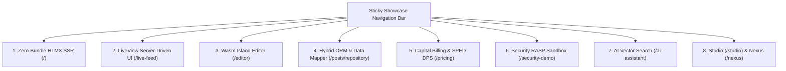

# The Sovereign SaaS Blog & Publisher 📖⚡

Welcome to **The Sovereign SaaS Blog & Publisher**, the official reference showcase and integration testbed for the **Rullst Framework**.

This application is **100% real and non-mocked**. It demonstrates how all core subsystems of Rullst integrate seamlessly into a single, cohesive, production-grade Rust application.

---

## 🌟 Flagship Subsystems Demonstrated



### 1. ⚡ All 3 Front-End Paradigms in Pure Rust
- **Zero-Bundle HTMX SSR (`/`)**: Ultra-fast declarative HTML generated at compile time using the `html!` macro and Axum static dispatch.
- **LiveView Server-Driven UI (`/live-feed`, `/_live`)**: Real-time state synchronization over persistent Tokio WebSockets with zero client-side JavaScript bundle.
- **Wasm Reactive Island (`/editor`, `/wasm-counter`)**: Client-side reactive micro-frontend compiled with `wasm-bindgen` and zero VDOM overhead.

### 2. 🗄️ Hybrid ORM & Multi-Tenancy
- **Active Record ([`lib.rs`](src/lib.rs))**: Zero-boilerplate data model with task-local SaaS multi-tenancy auto-scoping (`apply_tenant_scope`) responding to the `X-Tenant-ID` header.
- **Repository / Data Mapper ([`repository_demo.rs`](src/repository_demo.rs))**: Decoupled domain aggregations (`PostRepository::get_author_analytics`) executing parameterized SQLx queries.
- **Intent-Based Modeling**: Visualizer of automated index migrations via doc comments (`/// @index(tenant_id, title)`).

### 3. 💳 Capital SaaS Monetization & SPED Fiscal Engine ([`billing_demo.rs`](src/billing_demo.rs))
- **Quota Governance**: Real `Billable::check_quota` evaluation across Community, Pro, and Enterprise tiers.
- **Receita Federal SPED NFS-e Invoicing**: Direct in-memory Declaração de Prestação de Serviços (DPS) XML generation with enveloped **W3C XMLDSig** RSA-SHA256 digital signatures at **R$ 0.00 intermediary fees**.

### 4. 🛡️ Security Sandbox & RASP Inspection ([`security_demo.rs`](src/security_demo.rs))
- **RASP Engine**: Real-time inspection intercepting SQL Injection (`' OR '1'='1`) and Path Traversal (`../../../../etc/passwd`).
- **DLP Secret Masking**: Automatic redacting of sensitive bearer tokens and passwords (`redact_secrets`).
- **Login Jail**: Tarpit engine with progressive async backoff to defeat brute-force login attacks.
- **Honeypot Trap**: Decoy route `/wp-admin` triggering automated alerts to the SOC Threat Radar.

### 5. 🤖 AI RAG & Vector Semantic Search ([`ai_demo.rs`](src/ai_demo.rs))
- **Vector Search**: Real-time **Cosine Similarity** ranking over blog embeddings.
- **Prompt Injection Shield**: Input filter preventing adversarial prompt leakage and jailbreaks.

### 6. 🎛️ Integrated Control Rooms
- **Studio Developer Control Room**: Mounted at [`/studio`](http://127.0.0.1:3000/studio) (Database Inspector, SOC Threat Radar, Capital Revenue, Traces).
- **Nexus Admin CMS**: Mounted at [`/nexus`](http://127.0.0.1:3000/nexus) (Model CRUD, AI Assistant Chat).

---

## 🆚 Monorepo Showcase vs. CLI Blueprints

| Aspect | Monorepo Showcase (`examples/blog`) | CLI Scaffolding Blueprints (`cargo rullst new ... --blueprint blog`) |
| :--- | :--- | :--- |
| **Concept** | **"Kitchen Sink" / Living Testbed** of the framework. | **Clean Starter Boilerplate** for new commercial projects. |
| **Primary Goal** | Exercises **100% of Rullst crates and features** in a single autonomous binary. | Provides a **clean, idiomatic, noise-free foundation** for developers to build production apps immediately. |
| **Front-End Matrix** | Houses **all 3 paradigms simultaneously** (HTMX + LiveView WebSockets + Wasm Islands) to prove runtime interoperability. | Contains **only the frontend selected** by the developer during project creation (e.g. HTMX + Tailwind, React/Vite, Leptos SSR). |
| **Dependencies** | Local path monorepo crates (`path = "../../rullst"`). | Public published registry dependencies (`rullst = "12.0.0"` from crates.io). |
| **Included Features** | RASP attack sandboxes (`/security-demo`), Honeypots (`/wp-admin`), SPED NFS-e XMLDSig generator, and live mounted Studio & Nexus. | Production-ready MVC structure (`controllers/`, `models/`, `migrations/`, `pages/`) with zero clutter or demo artifacts. |
| **CI/CD Integration** | Primary binary compiled and executed in automated **DAST ZAP scans, E2E Smoke suites, and Codecov coverage**. | Scaffold generator validated independently in CLI unit tests. |

---

## 💡 Why This Separation is Essential (Zero Redundancy in Practice)

1. **Developers Want a Clean Slate, Not Demo Artifacts**:
   - When a developer bootstraps a new blog via `cargo rullst new my-blog --blueprint blog`, they expect a pristine production codebase.
   - If the starter template included SQL injection testing buttons, `/wp-admin` honeypots, or conflicting frontend paradigms, developers would have to waste hours deleting demo code before starting actual development.
   - The CLI blueprint delivers a **clean, production-grade starting point**.

2. **Framework Maintainers Need a Complete Living Lab**:
   - Framework maintainers and enterprise auditors need empirical proof that all decoupled crates (Security, ORM, Capital, AI, Live, Studio, Nexus) compile together without trait conflicts, panic paths, or memory leaks.
   - `examples/blog` acts as that **living testbed**, serving as the single source of truth for end-to-end integration health.

---

## 🧭 Interactive Route Catalog

| Route | Method | Subsystem | Description |
| :--- | :--- | :--- | :--- |
| `http://localhost:3000/` | `GET` | **HTMX SSR** | Landing feed with Active Record post creation form. |
| `http://localhost:3000/posts` | `POST` | **Active Record** | Saves a new post into SQLite under current tenant. |
| `http://localhost:3000/posts/repository` | `GET` | **Repository ORM** | Data Mapper analytics and Intent-Based `@index` visualizer. |
| `http://localhost:3000/live-feed` | `GET` | **LiveView** | Server-driven UI state synchronization over WebSockets. |
| `http://localhost:3000/editor` | `GET` | **Wasm Island** | Client-side reactive WebAssembly micro-frontend. |
| `http://localhost:3000/pricing` | `GET` | **Capital** | SaaS pricing tiers, `Billable` quota check & SPED DPS XMLDSig. |
| `http://localhost:3000/security-demo` | `GET` | **Security** | Interactive RASP, DLP masking & Login Jail tarpit sandbox. |
| `http://localhost:3000/ai-assistant` | `GET` | **AI & RAG** | Vector semantic search with Cosine Similarity & Prompt Shield. |
| `http://localhost:3000/wp-admin` | `GET` | **Honeypot** | Trap route triggering threat log to SOC Threat Radar. |
| `http://localhost:3000/studio` | `GET` | **Studio** | Developer Control Room (Database Inspector, Radar, Traces). |
| `http://localhost:3000/nexus` | `GET` | **Nexus** | Admin CMS with CRUD management and AI Assistant. |
| `http://localhost:3000/robots.txt` | `GET` | **SEO** | Auto-generated crawler directives. |
| `http://localhost:3000/sitemap.xml` | `GET` | **SEO** | XML sitemap metadata. |

---

## 🚀 Running Locally

```bash
# From workspace root
cargo run -p rullst-blog-example

# Or from this directory
cargo run
```

Open `http://127.0.0.1:3000` in your browser.

---

## 🏢 Multi-Tenant Scoping Test

By default, the database initializes isolated records for different tenants:

```bash
# 1. Enterprise Tenant:
curl -s -H "X-Tenant-ID: tenant-enterprise" http://localhost:3000/ | grep "Enterprise Architecture"

# 2. Startup Tenant:
curl -s -H "X-Tenant-ID: tenant-startup" http://localhost:3000/ | grep "High-Velocity MVP"

# 3. Community Tenant (Default):
curl -s http://localhost:3000/ | grep "The Sovereign SaaS Blog"
```

---

## 🧪 CI/CD & Automated Testing

This application is verified in GitHub Actions via:
- [`.github/workflows/e2e-smoke.yml`](../../.github/workflows/e2e-smoke.yml): Builds release binary, validates SSR status 200, CSP security headers, CSRF tokens, and SQLite writes.
- [`.github/workflows/dast-zap.yml`](../../.github/workflows/dast-zap.yml): Runs OWASP ZAP dynamic vulnerability scanner against the live running instance.
- [`.github/workflows/coverage.yml`](../../.github/workflows/coverage.yml): Validates code coverage exceeds 80% under `cargo-llvm-cov`.
