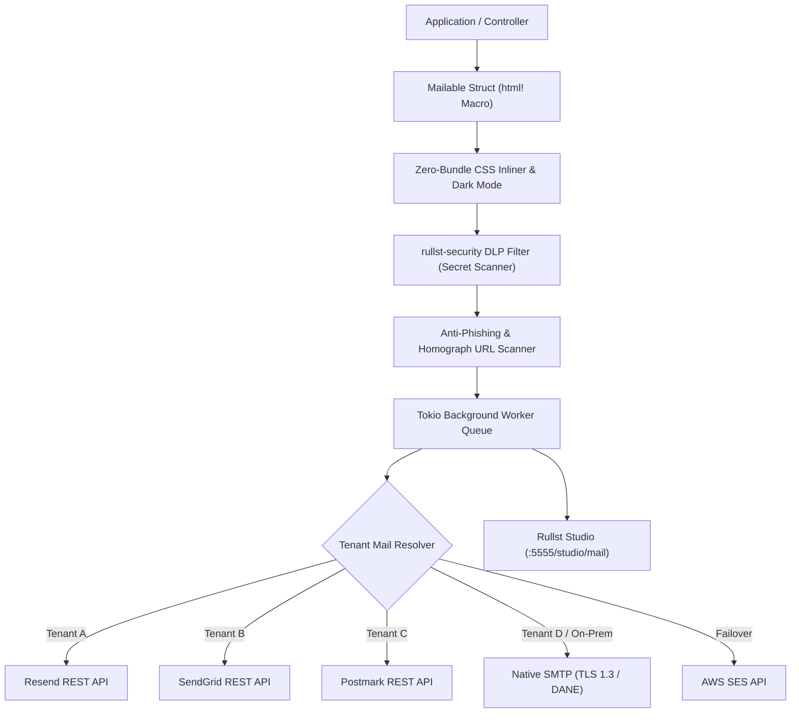

# Rullst Mail 📬 — Strategic Engineering Roadmap

> **Status policy (2026-08-26):** all ideas below are preserved. Older `[x]`
> markers can denote a useful foundation, not the entire enterprise claim in the
> item. See the audited [`rullst-mail` row](../ROADMAP.md#audit-of-the-detailed-crate-roadmaps)
> and the [capability ledger](../docs/src/capability-ledger.md) for verified
> boundaries.

> **Mission**: Transform `rullst-mail` into the most reliable, secure, productive, and developer-friendly transactional email engine in the Rust ecosystem — combining **Zero-Panic compile-time safety**, **AI-native intelligence**, **OWASP-grade DLP security**, and **Zero-Bundle SSR templating**.

---

## 🧭 High-Level Vision & Architecture

While traditional email libraries in Rust (e.g. `lettre`) focus purely on low-level SMTP transport, `rullst-mail` adopts Rullst's core philosophy of **"Emotional Productivity"** and **"Batteries Included"**. It seamlessly connects with:
- `rullst-core`: Non-blocking async background job queues (`rullst::queue`) & OpenTelemetry telemetry.
- `rullst-security`: Data Loss Prevention (DLP) secret scanner, homograph link filter & Login Jail tarpit.
- `rullst-ai`: Smart AI dunning, localized translation, and tone optimization.
- `rullst-capital`: Automated billing receipts, SaaS subscription renewals, and Receita Federal NFS-e DPS invoices.
- `rullst-studio`: Live visual template previews, DMARC forensic audit, and dead-letter queue inspect/retry controls.



---

## 📅 Roadmap Execution Phases

### Phase 1: Core Sending, Resilient Drivers & Background Queues 🚀 *(Completed / In Progress)*
- [x] **Unified `MailDriver` Trait**: Decoupled async interface supporting `LogDriver`, `SmtpDriver`, `ResendDriver`, and `SendGridDriver`.
- [x] **Fluent `Message` Builder**: Zero-cost API for constructing recipients, subjects, HTML bodies, and plain-text fallback variants.
- [~] **Scoped Panic Checks**: A small Kani harness and ordinary tests exist;
  they do not prove panic-freedom across every driver, parser, dependency, or
  generated application.
- [x] **Async Background Job Integration**: Automatic non-blocking dispatch through `rullst-core::queue::Queue` with configurable retry backoff.
- [x] **Typed In-Process Circuit Breaker & Automatic Failover (`FailoverDriver`)**: HTTP 5xx, 429 plus bounded `Retry-After`, transport errors, permanent provider responses, validation and configuration have explicit dispositions. Only transient/rate-limit failures open the circuit or reach a fallback; structured low-cardinality tracing records the decision without response bodies. SMTP distinguishes transient 4xx from permanent 5xx. Circuit state is fail-closed and poison-aware. Durable/distributed breaker state and an independently operated alert sink remain deployment concerns.
- [x] **Postmark REST plus bounded native AWS SES v2**: Postmark uses its live HTTP API. With `aws-ses`, `AwsSesDriver` uses the official AWS SDK and SigV4, supports temporary or caller-owned rotating credentials, attachments/CID and RFC 8058, and binds success to `MessageId`. Its loopback protocol contract is not live-account acceptance or inbox delivery. The legacy constructor remains only an offline mock or explicit bearer proxy.
- [x] **Bounded Delayed & Scheduled Mail Dispatch (`.send_at(timestamp)` & `.send_in(duration)`)**: SQLite and Redis persist schedules up to 366 days and do not claim early; Redis has a digest-pinned live contract. A queue worker consumes the due timestamp before transport, while direct Resend/SendGrid use provider fields. Unsupported real direct transports fail closed; offline fixtures retain metadata for assertions. Execution remains poll-dependent and at-least-once.
- [~] **Attachments & Inline CID Assets (`.attach_file()`, `.attach_bytes()`, `.attach_cid()`)**: Fluent owned-byte helpers and REST serialization exist for named providers; encoding copies memory and SMTP parity is incomplete.
- [~] **Pre-Flight Syntax & Disposable Email Filter**: A bounded local syntax check and static list of 150+ domains run before dispatch. This is not DNS/MX verification or a deliverability guarantee.
- [x] **Mandatory Dispatch Pipeline**: Facade, queue worker, tenant resolver, failover, and official drivers consistently enforce CRLF, deliverability, content-security, and DLP checks.
- [x] **Deterministic Provider Mocks**: Empty and `mock_*` credentials select an explicit, inspectable offline transport without HTTP or SMTP I/O.
- [ ] **Inbound Email Webhook & MIME Parser (`rullst-mail::inbound`)**: Processing incoming transactional replies (ticket comments, approval replies) with zero-copy multipart MIME parsing and SPF/DKIM verification.
- [ ] **Payload Pre-Compression Engine (Brotli / Gzip / Zstd)**: Automatic compression of large HTML bodies before payload transmission to providers supporting gzip/br headers.

---

### Phase 2: Beautiful Templating, i18n & Zero-Bundle CSS Inliner 🎨
- [ ] **Compile-Time `html!` Macro Mailables**: Define emails as strongly-typed Rust structs deriving `#[derive(Mailable)]`:
  ```rust
  #[derive(Mailable)]
  #[mail(subject = "Welcome to {app_name}, {user_name}!")]
  pub struct WelcomeEmail {
      pub user_name: String,
      pub app_name: String,
      pub confirmation_url: String,
  }
  ```
- [ ] **Zero-Disk Ephemeral PDF Invoice Streamer**: Direct in-memory rendering of HTML receipts/invoices into PDF byte buffers via lightweight native Rust renderer without temporary disk I/O (`/tmp`).
- [ ] **Zero-Bundle CSS Inliner (MJML-Free Engine)**: High-speed Rust-native CSS parser that automatically parses `<style>` classes (including Tailwind CSS) and converts them into inline `style="..."` attributes on all HTML elements prior to dispatch.
- [ ] **Universal Email Client Normalizer**:
  - Automatic injection of Microsoft Outlook MSO conditional tables (`<!--[if mso]>`).
  - Vector Markup Language (VML) fallbacks for bulletproof rounded buttons.
  - Native Dark Mode support via `@media (prefers-color-scheme: dark)` and `[data-ogsc]` tags.
- [x] **Automatic Plain-Text Fallback Generator**: Deterministic HTML-to-Text conversion (`strip_html_to_plain_text`) for accessibility and low-bandwidth mail clients automatically derived when `html(...)` is called.
- [ ] **Fluent i18n & Multi-Locale Mailables**: First-class localization support: `Message::new().locale("pt-BR")` or `WelcomeEmail::new().locale("es")` resolving localized catalogs and formatting.
- [ ] **AMP for Email & Schema.org Quick Actions**: Embedded micro-interactions (RSVP buttons, approval workflows, accordions) for interactive Gmail and Apple Mail clients.

---

### Phase 3: AI-Powered Intelligence & Smart Dunning 🤖
- [ ] **AI Smart Dunning (Revenue Recovery)**:
  - Deep integration with `rullst-capital` to automatically recover failed credit card charges and expired Pix/Boleto payments.
  - Adaptive prompt generation adjusting urgency, tone, and localized payment options based on customer tier and days overdue.
- [ ] **Autonomous Content & Tone Sanitizer**: Pre-flight LLM check analyzing subject lines and message tone to ensure optimal conversion, brand voice alignment, and avoidance of spam-trigger keywords.
- [ ] **Multilingual Auto-Translation**: Dynamically generate localized email variations based on the recipient's `Accept-Language` or user profile locale.

---

### Phase 4: Enterprise Security, DLP, Deliverability & Compliance 🛡️
- [x] **Outbound DLP Email Secret Interceptor**: Scans both email subject, HTML/plain-text bodies (`redact_email_secrets` & `.sanitize_secrets()`) to prevent accidental leaks of AWS keys (`AKIA...`), database passwords, private keys, API keys, and bearer tokens.
- [~] **Outbound Phishing & Homograph URL Interceptor (`.validate_security()`)**: Bounded URL heuristics reject selected schemes and mixed Latin/Cyrillic/Greek domains; this is not a complete HTML/URL parser or phishing guarantee.
- [~] **RFC 8058 One-Click List-Unsubscribe**: Supported providers emit the headers when an HTTPS unsubscribe URL is explicitly configured. Application policy and mailbox-provider compliance remain external.
- [ ] **DMARC, SPF & MTA-STS Live Ingestion Parser**: Automated ingestion endpoint for DMARC aggregate XML reports (`rua`/`ruf`) sent by major mailbox providers (Google, Microsoft, Yahoo), alerting against domain spoofing attempts in real time.
- [ ] **S/MIME X.509 Digital Signatures & PGP Envelope Encryption (`rullst-mail::crypto`)**: Native cryptographic signatures and payload encryption for high-assurance enterprise communications (banking receipts, medical reports, government alerts).
- [ ] **Tenant Outbound Quota Jail & Velocity Anomaly Tarpit**: Real-time anomalous sending rate detection (e.g. 500 emails/min from a compromised tenant account), automatically jailing the tenant and notifying the SOC before burning domain reputation.
- [ ] **Anti-Phishing Invisible Watermarking & Recipient Leak Tracing**: Steganographic zero-width token injection unique per recipient, enabling irrefutable tracing if confidential internal emails are leaked.
- [ ] **Strict TLS 1.3 / DANE / MTA-STS Delivery Enforcement**: Enforce opportunistic or strict TLS encryption, aborting SMTP handshakes on attempted plain-text downgrade attacks (STARTTLS stripping).
- [ ] **Unified Webhook Ingestion & Auto-Suppression Shield (`rullst-mail::webhooks`)**: Universal webhook handler endpoint for Resend, SendGrid, Postmark, and AWS SES with persistent `SuppressionList` for hard bounces and spam complaints.
- [~] **Authenticated Open & Click Tracking (`TrackingEngine`)**: Versioned purpose-bound HMAC tokens, TTL/skew and bounded local replay checks exist. Tokens are authenticated, not encrypted, and expose their email/URL payload after base64 decoding; consent, minimization and durable replay state remain application work.
- [ ] **BIMI & Verified Brand Mark Embedder**: Validation and certificate embedding (SVG Tiny P/S format and VMC) for Gmail & Apple Mail verified blue checkmarks and logos.
- [ ] **Native DKIM Signer (RSA & Ed25519)**: Native Rust cryptographic signing of headers and body hashes using `ring` / `rsa` for direct server-to-server SMTP deliverability without external mail relays.
- [ ] **Deliverability & DNS Health Scanner (`cargo rullst audit:mail`)**: Static and runtime CLI validator checking DNS records for SPF (`v=spf1`), DKIM public keys, DMARC policies (`p=reject`), and BIMI visual brand indicators.

---

### Phase 5: Developer Control Room — "Mail Radar" in Rullst Studio 📡
- [ ] **Live HTML Email Previewer (`/studio/mail`)**: Interactive Studio tab rendering email templates in real-time with responsive viewport toggles (Mobile, Desktop, Tablet) and dummy test fixtures.
- [ ] **Native OpenTelemetry (OTLP) Distributed Traces & Metrics**: Real-time OTLP spans and counters (`mail_dispatch_latency_seconds`, `mail_deliveries_total`, `mail_bounces_total{reason="hard"}`) linking HTTP requests directly to Tokio queue workers and driver responses.
- [ ] **Deliverability & Provider Health Scorecard in Studio**: Live visual cockpit displaying delivery success rate (%), bounce rate, open/click heatmaps, circuit breaker health status, and active API quota balances across all providers.
- [ ] **Honeypot Canary Address Radar**: Built-in canary addresses (`security-canary@domain.com`) alerting the SOC team in Rullst Studio upon unauthorized database scraping or credential stuffing.
- [ ] **Visual Mail Queue & Dead-Letter Inspector**: Real-time observability dashboard displaying pending, delivered, and failed email jobs, with one-click manual retry, smart backoff triage (429/503 transient vs 550 permanent), and payload inspection.
- [x] **In-Memory Mail Trap (`MailTrap` & `MemoryDriver`) for Local Development & E2E Testing**:
  - Catches all outgoing emails in memory without network I/O with fluent testing assertions:
    ```rust
    MailTrap::assert_sent_to("alice@example.com")
        .with_subject_contains("Welcome")
        .with_body_contains("Verify Email")
        .with_attachment_count(2)
        .with_attachment_named("invoice.pdf")
        .with_inline_cid("logo")
        .with_scheduled_at(future_time)
        .with_unsubscribe_url("https://example.com/unsub");
    ```
- [x] **Transactional Test Fixtures & Mail Factory (`MailFactory`)**: Pre-built transactional fixtures (`fake_welcome`, `fake_password_reset`, `fake_otp`, `fake_invoice`, `fake_security_alert`) for local dev, load testing, and fixture generation.
- [ ] **E2E Visual Diff Regression Testing (`cargo rullst test:mail`)**: Automated headless snapshot generator rendering emails across mobile (375px) and desktop (1200px) viewports with pixel-diff assertions in CI/CD.

---

### Phase 6: Multi-Tenant SaaS & Fiscal Blueprints 🏢
- [x] **Auth-Bound Multi-Tenancy Resolver (`TenantMailResolver`)**: Routes a trusted Core `TenantContext` to a validated in-memory driver registry, rejects invalid registration and fails closed when the registry is unavailable. The context stays explicit to avoid ambient cross-request identity; durable encrypted credentials, rotation and distributed updates remain application/deployment work.
- [ ] **Smart Domain Warm-Up Scheduler & Provider Rate Limiter**: Automated throttling and graduated daily sending schedules (e.g. Day 1: 50 emails/day, Day 7: 2,000 emails/day) for newly provisioned domains to build sender reputation safely.
- [x] **SaaS & Transactional Scaffolding Blueprints (`cargo rullst make:mail`)**:
  - `cargo rullst make:mail <Name> --welcome`: Onboarding and email verification template.
  - `cargo rullst make:mail <Name> --reset`: Secure time-limited password reset.
  - `cargo rullst make:mail <Name> --otp`: High-visibility OTP token delivery.
  - `cargo rullst make:mail <Name> --invoice`: SaaS billing and payment receipt.
  - `make:mail-invoice [Name]`: Evidence-aware National NFS-e and international SaaS receipt template.
  - `make:mail-dunning [Name]`: Progressive payment recovery sequence (D+1 gentle, D+3 action required, D+7 service paused).
  - **v12 bounded implementation:** all seven exposed variants validate
    identifiers, reject traversal/collisions, enable the required umbrella
    features, register modules, escape dynamic HTML and pass a materialized
    Clippy/runtime contract. The fiscal variant consumes typed
    `FiscalResponse` provenance and cannot label `OfflineMock` as authorized;
    the dunning stages do not infer account state or schedule themselves.

---

### Phase 7: Expanded REST Email Gateways & Serverless Transports 🌐
- [ ] **Mailgun REST API Driver (`MailgunDriver`)**: High-volume transactional REST client with native batch sending and EU/US region routing.
- [ ] **Brevo (Sendinblue) REST API Driver (`BrevoDriver`)**: Direct transactional v3 API integration with dynamic contact attribution and template variable interpolation.
- [ ] **MailerSend REST API Driver (`MailerSendDriver`)**: Modern developer-centric European transactional API with native activity webhooks.
- [ ] **Plunk Open-Source REST Driver (`PlunkDriver`)**: Lightweight transactional email driver for self-hosted and cloud Plunk instances.
- [ ] **Scaleway Transactional Email Driver (`ScalewayDriver`)**: European sovereign cloud transactional delivery with zero-trust API tokens.
- [ ] **Serverless Edge Delivery Harness**: Zero-TCP HTTP/HTTPS fallback transports optimized for Cloudflare Workers, AWS Lambda, and Fastly Compute@Edge WASM runtimes.

---

## Current capability boundary

The former unsourced competitor matrix is preserved in the immutable historical
snapshot referenced by `docs/src/v12.md`; it is not maintained as technical
evidence because external ecosystems change. The current Rullst-only status is:

| Capability | Current status |
| :--- | :--- |
| Message API, mandatory pipeline, queue envelope, offline mocks, MailTrap and factories | Implemented in the bounded scopes above |
| Resend, SendGrid and Postmark REST; optional SMTP | Implemented per provider, without universal method parity |
| Failover, scheduling, attachments, tenant routing, URL/DLP checks and tracking | Useful partial foundations with the named limits above |
| Native AWS SES v2/SigV4 | Implemented behind `aws-ses`; protocol-tested, without live-account/inbox claim |
| Inbound MIME, suppression webhooks, DKIM/DMARC, Studio Mail Radar and AI dunning | Not implemented |
| Universal deliverability, privacy/compliance, panic-freedom or competitor superiority | Not claimed |
