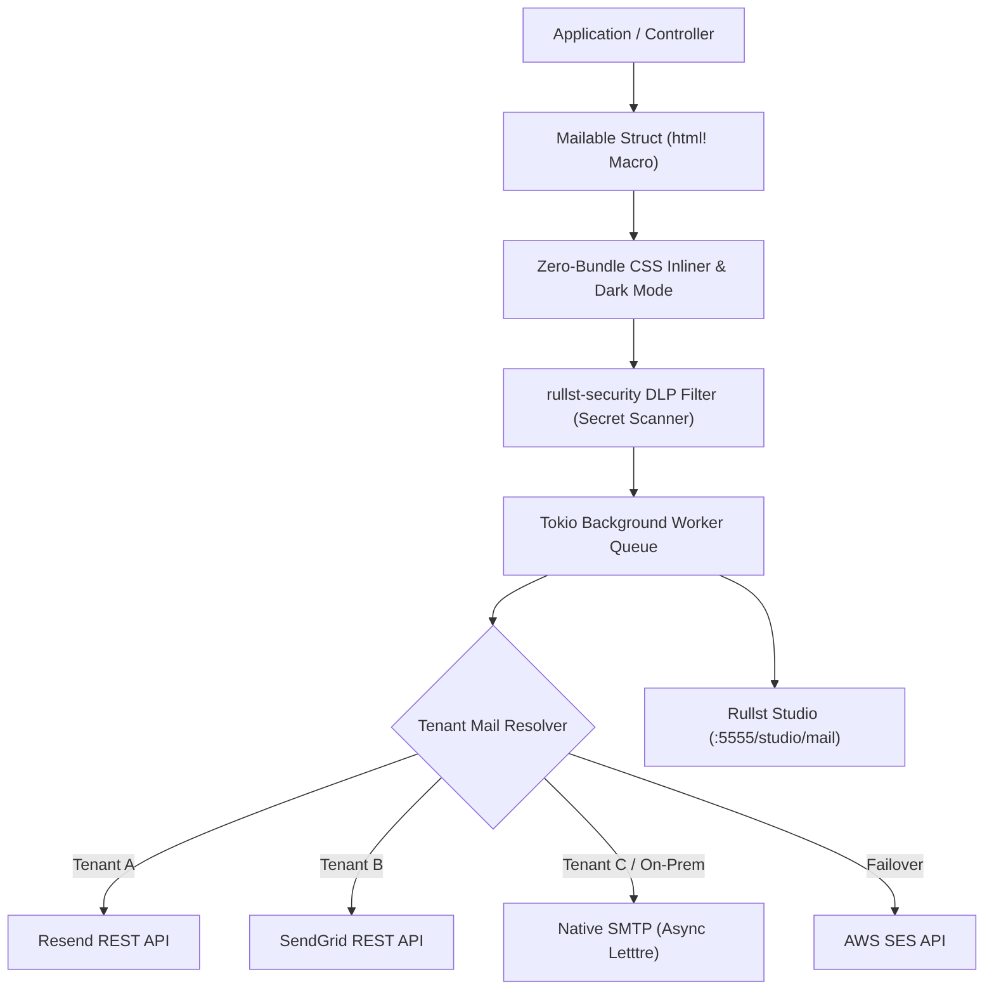

# Rullst Mail 📬 — Strategic Engineering Roadmap

> **Mission**: Transform `rullst-mail` into the most reliable, secure, productive, and developer-friendly transactional email engine in the Rust ecosystem — combining **Zero-Panic compile-time safety**, **AI-native intelligence**, **OWASP-grade DLP security**, and **Zero-Bundle SSR templating**.

---

## 🧭 High-Level Vision & Architecture

While traditional email libraries in Rust (e.g. `lettre`) focus purely on low-level SMTP transport, `rullst-mail` adopts Rullst's core philosophy of **"Emotional Productivity"** and **"Batteries Included"**. It seamlessly connects with:
- `rullst-core`: Non-blocking async background job queues (`rullst::queue`).
- `rullst-security`: Data Loss Prevention (DLP) secret scanner & credential leak prevention.
- `rullst-ai`: Smart AI dunning, localized translation, and tone optimization.
- `rullst-capital`: Automated billing receipts, SaaS subscription renewals, and Receita Federal NFS-e DPS invoices.
- `rullst-studio`: Live visual template previews with hot-reloading and dead-letter queue inspect/retry controls.



---

## 📅 Roadmap Execution Phases

### Phase 1: Core Sending, Resilient Drivers & Background Queues 🚀 *(Completed / In Progress)*
- [x] **Unified `MailDriver` Trait**: Decoupled async interface supporting `LogDriver`, `SmtpDriver`, `ResendDriver`, and `SendGridDriver`.
- [x] **Fluent `Message` Builder**: Zero-cost API for constructing recipients, subjects, HTML bodies, and plain-text fallback variants.
- [x] **Zero-Panic Formal Verification**: Kani proofs and property-based tests eliminating runtime panics on email formatting.
- [x] **Async Background Job Integration**: Automatic non-blocking dispatch through `rullst-core::queue::Queue` with configurable retry backoff.
- [ ] **Multi-Driver Circuit Breaker & Automatic Failover**: If primary driver (e.g. Resend) fails with 5xx or rate limit, automatically fallback to secondary driver (e.g. SendGrid or SMTP) with telemetry alerts.
- [ ] **AWS SES REST & Postmark Drivers**: Native HTTP client implementations with zero C-binding dependencies.

---

### Phase 2: Beautiful Templating & Zero-Bundle CSS Inliner 🎨
- [ ] **Compile-Time `html!` Macro Mailables**: Define emails as strongly-typed Rust structs deriving `#[derive(Mailable)]`:
  ```rust
  #[derive(Mailable)]
  #[mail(subject = "Welcome to {app_name}, {user_name}!")]
  pub struct WelcomeEmail {
      pub user_name: String,
      pub app_name: String,
      pub confirmation_url: String,
  }
  ```
- [ ] **Zero-Bundle CSS Inliner (MJML-Free Engine)**: High-speed Rust-native CSS parser that automatically parses `<style>` classes (including Tailwind CSS) and converts them into inline `style="..."` attributes on all HTML elements prior to dispatch.
- [ ] **Universal Email Client Normalizer**:
  - Automatic injection of Microsoft Outlook MSO conditional tables (`<!--[if mso]>`).
  - Vector Markup Language (VML) fallbacks for bulletproof rounded buttons.
  - Native Dark Mode support via `@media (prefers-color-scheme: dark)` and `[data-ogsc]` tags.
- [ ] **Automatic Plain-Text Generator**: Deterministic HTML-to-Text conversion for accessibility and low-bandwidth mail clients.

---

### Phase 3: AI-Powered Intelligence & Smart Dunning 🤖
- [ ] **AI Smart Dunning (Revenue Recovery)**:
  - Deep integration with `rullst-capital` to automatically recover failed credit card charges and expired Pix/Boleto payments.
  - Adaptive prompt generation adjusting urgency, tone, and localized payment options based on customer tier and days overdue.
- [ ] **Autonomous Content & Tone Sanitizer**: Pre-flight LLM check analyzing subject lines and message tone to ensure optimal conversion, brand voice alignment, and avoidance of spam-trigger keywords.
- [ ] **Multilingual Auto-Translation**: Dynamically generate localized email variations based on the recipient's `Accept-Language` or user profile locale.

---

### Phase 4: Enterprise Security, DLP & Compliance 🛡️
- [ ] **Outbound DLP Email Interceptor**: Scans both email subject, HTML/plain-text bodies, and attachments using `rullst-security::log_redactor` to prevent accidental leaks of AWS keys (`AKIA...`), database passwords, private keys, or personal identifiable data (PII).
- [ ] **RFC 8058 One-Click List-Unsubscribe**: Mandatory header generation (`List-Unsubscribe` & `List-Unsubscribe-Post: List-Unsubscribe=One-Click`) to comply with Google & Yahoo deliverability requirements.
- [ ] **Native DKIM Signer (RSA & Ed25519)**: Native Rust cryptographic signing of headers and body hashes using `ring` / `rsa` for direct server-to-server SMTP deliverability without external mail relays.
- [ ] **Deliverability & DNS Health Scanner (`cargo rullst audit:mail`)**: Static and runtime CLI validator checking DNS records for SPF (`v=spf1`), DKIM public keys, DMARC policies (`p=reject`), and BIMI visual brand indicators.

---

### Phase 5: Developer Control Room — "Mail Radar" in Rullst Studio 📡
- [ ] **Live HTML Email Previewer (`/studio/mail`)**: Interactive Studio tab rendering email templates in real-time with responsive viewport toggles (Mobile, Desktop, Tablet) and dummy test fixtures.
- [ ] **Visual Mail Queue & Dead-Letter Inspector**: Real-time observability dashboard displaying pending, delivered, and failed email jobs, with one-click manual retry and payload inspection.
- [ ] **In-Memory Mail Trap (`MailTrap`) for Local Development & E2E Testing**:
  - Catches all outgoing emails locally during development (`RULLST_ENV=development`) with a built-in web viewer at `/studio/mail/inbox`.
  - Seamless testing assertions:
    ```rust
    MailTrap::assert_sent_to("alice@example.com")
        .with_subject_contains("Welcome")
        .with_attachment("invoice.pdf");
    ```

---

### Phase 6: Multi-Tenant SaaS & Fiscal Blueprints 🏢
- [ ] **Dynamic Multi-Tenancy Resolver (`TenantMailResolver`)**: Automatically select SMTP credentials, custom domain sender addresses, or API keys based on the active `TenantContext` in multi-tenant B2B SaaS architectures.
- [ ] **SaaS & Fiscal Scaffolding Blueprints (`cargo rullst make:mail`)**:
  - `make:mail-welcome`: Onboarding and email verification template.
  - `make:mail-password-reset`: Secure time-limited password reset with anti-phishing indicators.
  - `make:mail-mfa-token`: High-visibility OTP token delivery.
  - `make:mail-invoice`: Brazilian Receita Federal NFS-e DPS & international SaaS receipt templates.
  - `make:mail-dunning`: Progressive payment recovery sequence (D+1 gentle, D+3 action required, D+7 service paused).

---

## 📊 Comprehensive Matrix of Competitive Advantages

| Feature & Capability | `lettre` (Rust Crate) | `Loco.rs` (Rust MVC) | `Laravel` (PHP) | Node.js (`React Email` / `Resend`) | `Rails` (`ActionMailer`) | **`rullst-mail`** 🚀 |
| :--- | :---: | :---: | :---: | :---: | :---: | :---: |
| **Type-Safe Rust API** | ✅ | ✅ | ❌ (PHP) | ❌ (TypeScript/JS) | ❌ (Ruby) | ✅ **Zero-Panic Verified** |
| **Async Background Queues** | ❌ (Manual) | ⚠️ (Requires Redis/Worker) | ⚠️ (Requires Redis/Queue) | ⚠️ (Requires BullMQ/Celery) | ⚠️ (Requires Sidekiq) | ✅ **Built-in (`rullst::queue`)** |
| **Zero-Bundle SSR Templating** | ❌ | ⚠️ (Tera/Askama string templates) | ⚠️ (Blade runtime) | ❌ (Heavy Node.js / React) | ⚠️ (ERB runtime) | ✅ **Native `html!` Macro (0 KB JS)** |
| **Zero-Cost CSS Inliner** | ❌ | ❌ | ⚠️ (Third-party package) | ⚠️ (Node.js runtime parsing) | ⚠️ (Roadie gem) | ✅ **Native Rust AST Engine** |
| **DLP Outbound Secret Scanner** | ❌ | ❌ | ❌ | ❌ | ❌ | ✅ **Native (`rullst-security`)** |
| **AI Smart Dunning Recovery** | ❌ | ❌ | ❌ | ❌ | ❌ | ✅ **Native (`rullst-ai` + `capital`)** |
| **Live Studio Inspector & MailTrap** | ❌ | ❌ | ⚠️ (External Mailpit/Mailtrap) | ⚠️ (Local dev server) | ⚠️ (LetterOpener gem) | ✅ **Built-in `/studio/mail` UI** |
| **Dynamic Multi-Tenancy Resolver** | ❌ | ❌ (Manual) | ⚠️ (Custom MailManager) | ❌ (Manual) | ❌ (Manual) | ✅ **Native `TenantMailResolver`** |
| **Formal Panic-Freedom (Kani)** | ❌ | ❌ | ❌ | ❌ | ❌ | ✅ **Mathematical Proofs** |
| **Brazilian SPED / NFS-e Receipts** | ❌ | ❌ | ❌ | ❌ | ❌ | ✅ **Native `rullst-capital` DPS** |
| **RFC 8058 1-Click Unsubscribe** | ❌ (Manual) | ❌ (Manual) | ⚠️ (Manual Headers) | ⚠️ (Manual Headers) | ❌ (Manual) | ✅ **Automatic Engine Injection** |
